# Phase 02 — Prisma Schema

> **PortalGERM status: IMPLEMENTED AND VERIFIED.** The authoritative implementation is code commit `10e3949bc03c6330dad9430f3e48ae1155ec93b7`; the reproducible acceptance record is [`evidence/2026-07-19-phase-02.md`](./evidence/2026-07-19-phase-02.md). Current ADRs, [architecture blueprint](./architecture-blueprint.md) and [requirements matrix](./requirements-matrix.md) remain authoritative for later service work.

> Detail file for [00-PLAN.md](./00-PLAN.md) Phase 02. Read [99-rules-quickref.md](./99-rules-quickref.md) §27 before starting.

## Goal

Build the authoritative Prisma schema and committed migrations from the Blueprint, Requirement IDs and ADRs. The transferred inventory below is a capability-mapping aid: its legacy names and field shapes are replaced where the current contract says so, and a checkbox is earned only when the replacement capability, constraints and tests exist.

## Data model overview (ERD)

High-level map of the principal entities and relationships (not every field/model — see the checklist below for the full set). Money fields are integer **Rappen** except `SalaryBand` (whole CHF).

```mermaid
erDiagram
  User ||--o| CandidateProfile : has
  User ||--o| EmployerProfile : has
  User ||--o| Credential : authenticates
  User ||--o{ Session : owns
  User ||--o{ PasswordResetToken : resets
  User ||--o{ CompanyMembership : "member via"
  User ||--o{ UserConsentEvent : accepts

  Company ||--o{ CompanyMembership : has
  Company ||--o{ Job : posts
  Company ||--o{ EmployerSubscription : subscribes
  Company ||--o{ Order : buys
  Company ||--o{ Invoice : billed
  Company ||--o{ EntitlementGrant : receives
  Company ||--o{ CreditAccount : owns
  Plan ||--o{ PlanVersion : versions
  PlanVersion ||--o{ EmployerSubscription : defines
  Product ||--o{ ProductVersion : versions
  Order ||--o{ OrderLine : snapshots
  ProductVersion ||--o{ OrderLine : references

  CandidateProfile ||--o{ CandidateSkill : "rates"
  CandidateProfile ||--o{ CandidateLanguage : "speaks"
  CandidateProfile ||--o{ Application : submits
  CandidateProfile ||--o{ SavedJob : saves
  CandidateProfile ||--o{ JobAlert : configures
  CandidateProfile ||--o{ CandidateConsent : "records consent"
  CandidateProfile ||--o| RadarProfile : "publishes anonymously"

  Job ||--o{ JobRevision : versions
  JobRevision ||--o{ JobRevisionSkill : requires
  JobRevision ||--o{ JobRevisionLanguage : requires
  Job ||--o{ Application : receives
  Job ||--o{ JobBoost : "boosted by"
  JobRevision }o--|| Category : "in"
  JobRevision }o--|| Canton : "located in"
  Skill ||--o{ JobRevisionSkill : "used in"
  Skill ||--o{ CandidateSkill : "claimed in"

  Order ||--o| Invoice : generates
  Order ||--o{ PaymentEvent : emits
  OrderLine ||--o| JobBoost : "may fulfill"

  Company ||--o{ EmployerContactRequest : sends
  CandidateProfile ||--o{ EmployerContactRequest : receives
  EmployerContactRequest ||--o{ ContactRequestEvent : emits
  EmployerContactRequest ||--o| IdentityRevealGrant : "may lead to"
  Application ||--|| ApplicationSubmissionSnapshot : snapshots
  Application ||--|| Conversation : opens
  Conversation ||--o{ Message : contains
```

## Prerequisites

- [x] Phase 01 complete (`prisma init` done, datasource = PostgreSQL)

## Legacy coverage inventory (not a literal field contract)

> The transferred bullets below preserve the earlier domain coverage, but several field shapes conflict with the audited architecture. **Do not tick or implement a legacy bullet literally when it conflicts with ADR-017–027, Blueprint §6 or the PortalGERM Execution Contract.** The replacement schema must cover the same business capability with current versioned/draft/ledger/event models and map the legacy item in migration/ERD evidence.
>
> Mandatory replacements include: `emailNormalized` and hashed Session/Reset tokens; draft-capable Candidate/Company onboarding; canonical append-only Consent + separate RadarProfile; opaque Radar identifier; ContactRequest expiry/idempotency/funding source; request-scoped unique RevealGrant; JobRevision/ScoreSnapshot/Assignment; CompanyVerification/Event; versioned Plan/Product/Entitlement; CreditAccount/Ledger instead of mutable `amount/used`; immutable Order/Invoice lines/snapshots/target context/idempotency; ImportSource/Run/Item/Decision; and structured Audit/Notification/Metric models. See [architecture-blueprint.md](./architecture-blueprint.md) §6.

### Enums
- [x] `Role` — `CANDIDATE`, `EMPLOYER`, `RECRUITER`, `ADMIN`
- [x] `UserStatus` — `ACTIVE`, `SUSPENDED`, `DELETED`
- [x] `CompanyMembershipRole` — `OWNER`, `ADMIN`, `RECRUITER`, `VIEWER`
- [x] `CompanyMembershipStatus` — `ACTIVE`, `SUSPENDED`, `REMOVED`
- [x] `CompanyInvitationStatus` — `PENDING`, `ACCEPTED`, `REVOKED`, `EXPIRED`
- [x] `CompanyInvitationEventKind` — `CREATED`, `RESENT`, `ACCEPTED`, `REVOKED`, `EXPIRED`; `CompanyMembershipEventKind` — `CREATED`, `ROLE_CHANGED`, `SUSPENDED`, `REACTIVATED`, `PLAN_LIMIT_SUSPENDED`, `PLAN_LIMIT_REACTIVATED`, `REMOVED`
- [x] `CompanyStatus` — `DRAFT`, `ACTIVE`, `SUSPENDED`, `CLOSED`; verification is an orthogonal request/event lifecycle and not duplicated here
- [x] `CompanyStatusEventKind` — `DRAFT_CREATED`, `ONBOARDING_COMPLETED`, `SUSPENDED`, `REACTIVATED`, `CLOSED`
- [x] `CompanyClaimStatus` — `PENDING`, `NEEDS_EVIDENCE`, `APPROVED`, `REJECTED`, `CANCELLED`; `CompanyClaimEventKind` — `CREATED`, `EVIDENCE_REQUESTED`, `EVIDENCE_ADDED`, `APPROVED`, `REJECTED`, `CANCELLED`
- [x] `CompanyVerificationStatus` — `DRAFT`, `PENDING`, `CHANGES_REQUESTED`, `VERIFIED`, `REJECTED`, `REVOKED`
- [x] `OnboardingStatus` — `DRAFT`, `COMPLETE`
- [x] `CandidateOnboardingEventKind` — `DRAFT_CREATED`, `COMPLETED`, `REOPENED`
- [x] `DocumentPurpose` — `CV`; later purposes require an explicit enum migration/review
- [x] `DocumentStatus` — `ACTIVE`, `REMOVED`, `REJECTED`
- [x] `JobAssignmentRole` — `EDITOR`, `REVIEWER`, `PIPELINE`; `JobAssignmentStatus` — `ACTIVE`, `REVOKED`, `EXPIRED`
- [x] `JobAssignmentEventKind` — `ASSIGNED`, `ROLE_CHANGED`, `REVOKED`, `EXPIRED`
- [x] `JobStatus` — `DRAFT`, `SUBMITTED`, `IN_REVIEW`, `CHANGES_REQUESTED`, `APPROVED`, `PUBLISHED`, `PAUSED`, `EXPIRED`, `CLOSED`, `REJECTED`, `REMOVED`; `REMOVED` is a terminal, non-public tombstone used only for an untouched imported Draft rollback
- [x] `JobStatusEventKind` — `DRAFT_CREATED`, `DRAFT_UPDATED`, `SUBMITTED`, `REVIEW_STARTED`, `CHANGES_REQUESTED`, `APPROVED`, `PUBLISHED`, `PAUSED`, `REACTIVATED`, `EXPIRED`, `CLOSED`, `REJECTED`, `REVISION_REOPENED`, `IMPORT_ROLLED_BACK`
- [x] `CompanyVerificationEventKind` — `DRAFT_CREATED`, `SUBMITTED`, `EVIDENCE_REQUESTED`, `RESUBMITTED`, `VERIFIED`, `REJECTED`, `REVOKED`
- [x] `JobType` — `PERMANENT`, `TEMPORARY`, `FREELANCE`, `INTERNSHIP`, `APPRENTICESHIP`, `HOLIDAY_JOB`
- [x] `RemoteType` — `ONSITE`, `HYBRID`, `REMOTE`
- [x] `Language` — `DE`, `FR`, `IT`, `EN`
- [x] `SalaryPeriod` — `YEARLY`, `MONTHLY`, `HOURLY`
- [x] `ApplicationEffort` — `SIMPLE`, `MEDIUM`, `LONG`
- [x] `RemotePreference` — `ONSITE`, `HYBRID`, `REMOTE`, `ANY`
- [x] `ApplicationStatus` — `SUBMITTED`, `IN_REVIEW`, `SHORTLISTED`, `INTERVIEW`, `OFFER`, `HIRED`, `REJECTED`, `WITHDRAWN`
- [x] `ApplicationRejectionReason` — `NOT_A_MATCH`, `POSITION_FILLED`, `REQUIREMENTS_NOT_MET`, `OTHER_REVIEWED`; the optional candidate-visible note is separate, bounded and sanitized
- [x] `ConversationKind` — `APPLICATION`, `TALENT_RADAR`
- [x] `SubscriptionStatus` — `SCHEDULED`, `ACTIVE`, `CANCELLING`, `EXPIRED`, `CANCELLED`; P0 has no Trial and real-payment `PAST_DUE` is deferred with that provider. Effective reads treat a paid `SCHEDULED` successor as active only once `currentPeriodStart <= at`, even if the status projector lags.
- [x] `PlanPriceMode` — `FIXED`, `CONTRACT`; `BillingInterval` — `MONTHLY`, `ANNUAL`; `SubscriptionChangeKind` — `DOWNGRADE`, `CANCEL`; `SubscriptionChangeStatus` — `PENDING`, `APPLIED`, `REVOKED`
- [x] `OrderStatus` — `DRAFT`, `PENDING`, `PAID`, `FAILED`, `CANCELLED`, `EXPIRED`; refund/chargeback states are deferred
- [x] `PaymentProvider` — `MOCK`, `STRIPE`
- [x] `InvoiceStatus` — `DRAFT`, `ISSUED`, `PAID`, `VOID`; overdue is derived from due date while unpaid, refund/credit-note states are deferred
- [x] `BoostStatus` — `SCHEDULED`, `ACTIVE`, `EXPIRED`, `CANCELLED`
- [x] `ProductType` — `JOB_BOOST`, `ADDITIONAL_JOB`, `FEATURED_JOB`, `FEATURED_EMPLOYER`, `NEWSLETTER`, `SOCIAL_PUSH`, `IMPORT_SETUP`, `CONTACT_PACK`, `SUCCESS_FEE`
- [x] `CreditType` — `JOB_BOOST`, `TALENT_CONTACT`, `NEWSLETTER`, `SOCIAL_PUSH`; P0 unit mapping is closed: one `TALENT_CONTACT` funds one ContactRequest and one `JOB_BOOST` is `BOOST_7D_V1` (exactly seven days, never 30). Future units require a typed/versioned migration rather than reinterpretation
- [x] `AnalyticsLevel` — `NONE`, `BASIC`, `ADVANCED`, `PRO`
- [x] `EntitlementKey` — `ACTIVE_JOB_LIMIT`, `SEAT_LIMIT`, `TALENT_RADAR_ACCESS`, `TALENT_CONTACT_ALLOWANCE`, `JOB_BOOST_ALLOWANCE`, `ANALYTICS_LEVEL`, `ENHANCED_COMPANY_PROFILE`, `EMPLOYER_IMPORT_ACCESS`; unknown/free-form keys are impossible and future keys require a migration plus gate/test update
- [x] `EntitlementValueType` — `BOOLEAN`, `INTEGER`, `ANALYTICS_LEVEL`; the key→type mapping is fixed below and is not client-selectable
- [x] `CreditFundingSource` — `PLAN_ALLOWANCE`, `PURCHASED_PACK`, `ADMIN_GRANT`; `CreditLedgerKind` — `GRANT`, `CONSUME`, `EXPIRE`, `REVERSAL`
- [x] `LeadStatus` — `NEW`, `CONTACTED`, `QUALIFIED`, `WON`, `LOST`
- [x] `AbuseTargetType` — `JOB`, `COMPANY`, `USER`, `MESSAGE`
- [x] `AbuseStatus` — `OPEN`, `IN_REVIEW`, `RESOLVED`, `DISMISSED`
- [x] `AbuseSeverity` — `LOW`, `MEDIUM`, `HIGH`, `CRITICAL`; `AbuseEventKind` — `CREATED`, `TRIAGED`, `ASSIGNED`, `RESTRICTION_APPLIED`, `RESTRICTION_LIFTED`, `RESOLVED`, `DISMISSED`, `NOTE_ADDED`
- [x] `ModerationRestrictionType` — `HIDE_JOB`, `PAUSE_COMPANY`, `SUSPEND_USER`, `BLOCK_MESSAGE_THREAD`; `ModerationRestrictionStatus` — `ACTIVE`, `LIFTED`, `EXPIRED`
- [x] `ImportRunStatus` — `PENDING`, `PARSING`, `PREVIEW_READY`, `PARTIALLY_COMMITTED`, `COMMITTED`, `PARTIALLY_ROLLED_BACK`, `ROLLED_BACK`, `FAILED`
- [x] `ImportSetupApprovalStatus` — `DRAFT`, `APPROVED`, `USED`, `EXPIRED`, `REVOKED`; only `APPROVED` and unexpired may enter checkout
- [x] `EmailLogStatus` — `QUEUED`, `MOCK_RECORDED`, `SENT`, `FAILED`; the MVP mock never writes `SENT`
- [x] `ContactRequestStatus` — `PENDING`, `ACCEPTED`, `DECLINED`, `EXPIRED`, `CANCELLED`
- [x] `ContactRequestEventKind` — `CREATED`, `ACCEPTED`, `DECLINED`, `EXPIRED`, `CANCELLED`, `REVEAL_GRANTED`
- [x] `RevealField` — `DISPLAY_NAME`, `EMAIL`, `PHONE`, `CV_METADATA`; exact address, raw CV bytes, private notes and every unlisted field can never be granted
- [x] `PrivacyRequestType` — `EXPORT`, `DELETE`, `CORRECT`
- [x] `PrivacyRequestStatus` — `PENDING`, `IDENTITY_CHECK`, `IN_PROGRESS`, `COMPLETED`, `REJECTED`, `CANCELLED`
- [x] `PrivacyRequestEventKind` — `CREATED`, `IDENTITY_REQUESTED`, `VERIFIED`, `PROCESSING_STARTED`, `MANIFEST_CREATED`, `COMPLETED`, `REJECTED`, `CANCELLED`, `NOTE_ADDED`
- [x] `PrivacyCorrectionFieldCode` — `DISPLAY_NAME`, `LEGAL_NAME`, `EMAIL`, `PHONE`, `LOCATION`, `PROFILE_PREFERENCES`, `CONSENT_HISTORY`, `APPLICATION_DATA`, `OTHER_ACCOUNT_DATA`; deletion dependency/outcome, correction outcome and rejection-reason codes are the equally closed const/enums in Phase 14 and never free strings
- [x] `RadarConsentKind` — `TALENT_RADAR_VISIBILITY` only; it belongs exclusively to `CandidateConsent`
- [x] `UserConsentKind` — `TERMS`, `MARKETING`, `DATA_USE`, `JOB_ALERT_DELIVERY`; it belongs exclusively to `UserConsentEvent` and cannot express Radar visibility. Service Alert delivery is distinct from Marketing.
- [x] `AlertFrequency` — `DAILY`, `WEEKLY`
- [x] `JobAlertStatus` — `ACTIVE`, `PAUSED`, `UNSUBSCRIBED`, `DELETED`
- [x] `JobAlertEventKind` — `CREATED`, `UPDATED`, `PAUSED`, `RESUMED`, `DIGEST_MOCK_RECORDED`, `UNSUBSCRIBED`, `DELETED`
- [x] `Seniority` — `JUNIOR`, `MID`, `SENIOR`, `LEAD`
- [x] `ImportInputSource` — `UPLOAD`, `PASTE` (named differently from the `ImportSource` model)
- [x] `ImportFormat` — `XML`, `JSON`
- [x] `ImportItemStatus` — `PENDING`, `OK`, `ERROR`, `COMMITTED`, `ROLLED_BACK`, `CONFLICT_MANUAL_REMEDIATION`
- [x] `ImportDecisionKind` — `APPROVE`, `REJECT`
- [x] `ApplicationEventKind` — `STATUS_CHANGE`, `CANDIDATE_NOTE_UPDATED`, `EMPLOYER_NOTE_ADDED`, `MESSAGE_SENT`, `SCHEDULED_INTERVIEW`
- [x] `PaymentEventKind` — `CHECKOUT_CREATED`, `PAID`, `FAILED`, `CANCELLED`, `REFUNDED`
- [x] `LanguageLevel` — `A1`, `A2`, `B1`, `B2`, `C1`, `C2`, `NATIVE`
- [x] `ContentPageType` — `GUIDE`, `CLUSTER`; `ContentRevisionStatus` — `DRAFT`, `IN_REVIEW`, `APPROVED`, `PUBLISHED`, `REJECTED`, `UNPUBLISHED`
- [x] `ContentEventKind` — `DRAFTED`, `SUBMITTED_FOR_REVIEW`, `APPROVED`, `REJECTED`, `PUBLISHED`, `UNPUBLISHED`
- [x] `SupportCategory` — `ACCOUNT`, `APPLICATION`, `EMPLOYER`, `BILLING`, `PRIVACY`, `ABUSE`, `OTHER`; `SupportPriority` — `LOW`, `NORMAL`, `HIGH`, `URGENT`; `SupportCaseStatus` — `OPEN`, `TRIAGED`, `WAITING_FOR_REQUESTER`, `IN_PROGRESS`, `RESOLVED`, `CLOSED`
- [x] `SupportCaseEventKind` — `CREATED`, `TRIAGED`, `ASSIGNED`, `INFORMATION_REQUESTED`, `REPLIED`, `RESOLVED`, `REOPENED`, `CLOSED`
- [x] `SystemTaskKind` — `MODERATION`, `VERIFICATION`, `SUPPORT`, `SALES_FOLLOW_UP`, `CONTENT_REVIEW`, `SUPPLY_GAP`, `USAGE_DIAGNOSTIC`, `RENEWAL_REVIEW`, `RETENTION_RISK`, `CREDIT_EXPIRY`; `SystemTaskStatus` — `OPEN`, `ASSIGNED`, `IN_PROGRESS`, `DONE`, `DISMISSED`, `EXPIRED`
- [x] `NotificationKind` — `APPLICATION_SUBMITTED`, `APPLICATION_STATUS_CHANGED`, `MESSAGE_RECEIVED`, `CONTACT_REQUEST_RECEIVED`, `CONTACT_REQUEST_ACCEPTED`, `CONTACT_REQUEST_DECLINED`, `CONTACT_REQUEST_CANCELLED`, `IDENTITY_REVEAL_GRANTED`, `IDENTITY_REVEAL_REVOKED`, `JOB_REVIEW_CHANGED`, `COMPANY_VERIFICATION_CHANGED`, `TEAM_INVITATION_CREATED`, `TEAM_MEMBERSHIP_CHANGED`, `ORDER_PAID`, `INVOICE_ISSUED`, `SUBSCRIPTION_CHANGED`, `USAGE_WARNING`, `SYSTEM_TASK_ASSIGNED`, `SUPPORT_CASE_CHANGED`, `PRIVACY_REQUEST_CHANGED`; additions require migration plus payload-schema/test update
- [x] `AuditActorKind` — `USER`, `SYSTEM`, `ANONYMOUS`; `AuditResult` — `SUCCEEDED`, `DENIED`, `FAILED`
- [x] `AuditTargetType` — `USER`, `SESSION`, `COMPANY`, `MEMBERSHIP`, `INVITATION`, `CLAIM_REQUEST`, `VERIFICATION_REQUEST`, `JOB`, `JOB_REVISION`, `JOB_ASSIGNMENT`, `APPLICATION`, `CONVERSATION`, `MESSAGE`, `RADAR_PROFILE`, `CONTACT_REQUEST`, `IDENTITY_REVEAL_GRANT`, `PRIVACY_REQUEST`, `ABUSE_REPORT`, `MODERATION_RESTRICTION`, `PLAN_VERSION`, `PRODUCT_VERSION`, `SUBSCRIPTION`, `ORDER`, `INVOICE`, `CREDIT_LEDGER_ENTRY`, `JOB_BOOST`, `IMPORT_SOURCE`, `IMPORT_RUN`, `SUPPORT_CASE`, `CONTENT_REVISION`, `SALES_LEAD`, `SYSTEM_TASK`, `CLUSTER_LAUNCH_ASSESSMENT`, `TAX_RATE_VERSION`
- [x] `AuditAction` — a real closed Prisma enum whose **exact member set** is `AUDIT_ACTIONS_V1`, the backticked actions in Phase 16's exhaustive Audit coverage matrix. The implementation mirrors that table literally and a CI contract test compares the TypeScript const, Prisma enum and matrix; no string not present in all three compiles/migrates. This single-source generation rule prevents a second manually drifting action list.
- [x] `CatalogVersionStatus` — `DRAFT`, `SCHEDULED`, `ACTIVE`, `INACTIVE`; `TaxRateReviewStatus` — `DRAFT`, `APPROVED`, `RETIRED`
- [x] `SalaryDatasetReviewStatus` — `DRAFT`, `APPROVED`, `RETIRED`; `SubscriptionEventKind` — `ACTIVATED`, `CHANGE_SCHEDULED`, `CHANGED`, `CANCELLATION_SCHEDULED`, `EXPIRED`, `CANCELLED`
- [x] `AnalyticsPurpose` — `ESSENTIAL_OPERATIONAL`, `PRODUCT_ANALYTICS`; `AnalyticsEventKind` — `PUBLIC_VALUE_VIEWED`, `SEARCH_SUBMITTED`, `SEARCH_RESULTS_VIEWED`, `JOB_DETAIL_VIEWED`, `JOB_SAVED`, `APPLY_INTENT_STARTED`, `APPLICATION_SUBMITTED`, `APPLICATION_STATUS_CHANGED`, `CANDIDATE_REGISTERED`, `CANDIDATE_PROFILE_COMPLETED`, `RADAR_OPTED_IN`, `JOB_ALERT_ACTIVATED`, `EMPLOYER_REGISTERED`, `COMPANY_ONBOARDING_COMPLETED`, `COMPANY_VERIFICATION_SUBMITTED`, `COMPANY_VERIFIED`, `JOB_DRAFT_CREATED`, `JOB_SUBMITTED`, `JOB_PUBLISHED`, `EMPLOYER_RESPONSE_RECORDED`, `CONTACT_REQUEST_SENT`, `CONTACT_REQUEST_ACCEPTED`, `CONTACT_REQUEST_DECLINED`, `IDENTITY_REVEAL_GRANTED`, `PRICING_VIEWED`, `LIMIT_REACHED`, `CHECKOUT_STARTED`, `CHECKOUT_COMPLETED`, `SUBSCRIPTION_CHANGED`, `LEAD_SUBMITTED`, `LEAD_QUALIFIED`, `LEAD_WON`, `BOOST_ACTIVATED`, `MODERATION_ACTIONED`
- [x] `DataProvenance` — `LIVE`, `DEMO`, `TEST`; Demo/Test rows are non-indexable and excluded from production/public market evidence
- [x] `JobReportingResult` — `REQUIRES_REPORTING`, `NOT_REQUIRED`, `UNKNOWN`; `SalesActivityKind` — `NOTE`, `CONTACT_ATTEMPT`, `STATUS_CHANGE`, `TASK_ASSIGNED`, `OUTCOME`
- [x] `RequiredDocumentKind` — `NONE`, `CV`, `COVER_LETTER`, `CERTIFICATES`, `REFERENCES`, `PORTFOLIO`, `OTHER`; `NONE` is mutually exclusive with every other value. P0 publication accepts only `NONE|CV|COVER_LETTER`; the other enum members remain hidden and fail closed until the P1 document-storage gate. `ApplicationContactKind` — `EMAIL`, `PHONE`, `APPLY_URL`
- [x] `JobBenefitCode` — `FLEXIBLE_WORK`, `HOME_OFFICE`, `PAID_TRAINING`, `PENSION_TOP_UP`, `PARENTAL_LEAVE`, `CHILDCARE_SUPPORT`, `PUBLIC_TRANSPORT_SUPPORT`, `MEAL_SUPPORT`, `HEALTH_WELLBEING`, `EXTRA_LEAVE`, `PERFORMANCE_BONUS`; this closed Product-owned taxonomy changes only through a reviewed enum migration, seed update and Fair-v2 golden test
- [x] `ClusterLaunchAssessmentStatus` — `DRAFT`, `READY`, `ACTIVATED`, `REVOKED`, `EXPIRED`; `ClusterLaunchEventKind` — `EVALUATED`, `PRODUCT_APPROVED`, `OPS_APPROVED`, `ACTIVATED`, `REVOKED`, `EXPIRED`

> **Enum-Strategie:** Alle Status-/Typ-Felder sind echte Prisma-Enums (keine freien Strings) — Type-Safety end-to-end. Siehe [decisions.md](./decisions.md) ADR-007.

### Core models

- [x] **`User`** — `id`, original `email`, canonical `emailNormalized @unique`, `role: Role`, `name?`, `status: UserStatus @default(ACTIVE)`, `dataProvenance: DataProvenance`, `emailVerifiedAt?`, `lastLoginAt?`, `createdAt`, `updatedAt`. Production registration hard-codes `LIVE`; DEMO/TEST can only be created by the production-blocked seed/test path. Never use display-case email as the uniqueness or login boundary and never place credential secrets on a general-purpose User DTO.
- [x] **`Credential`** — `id`, `userId @unique`, `passwordHash`, algorithm/version metadata, `passwordChangedAt`, timestamps. Auth repositories select it explicitly; general User repositories cannot expose it.
- [x] **`Session`** — `id`, `userId`, `tokenHash @unique`, `expiresAt`, `absoluteExpiresAt`, `createdAt`, `rotatedAt?`, `userAgent?`, `ipHash?`. Indexes: `userId`, `tokenHash`; raw tokens exist only in the secure cookie.
- [x] **`PasswordResetToken`** — hashed single-use token, `userId`, `expiresAt`, `usedAt?`, created/request metadata and indexes; the mock flow still completes a real local password reset without revealing account existence.
- [x] **`RateLimitBucket`** — shared PostgreSQL atomic limiter state: server-built namespace/key HMAC, window start/end, count/version and expiry; unique `(namespace,keyHash,windowStart)`. It stores no raw IP/email/target token, increments with one atomic upsert/lock and is pruned after the longest preset window plus 30 days. Production never falls back to process memory.
- [x] **`CandidateProfile` + `CandidateOnboardingEvent`** — `id`, `userId @unique`, draft-capable onboarding fields (`firstName?`, `lastName?`, `publicDisplayName?`, `phone?`, location/preferences/skills/languages/salary including period, workload, remote/mobility/availability, summary and document metadata), `onboardingStatus`, timestamps and append-only complete/reopen evidence. Provenance is inherited from its User and may never diverge. Do not store a competing Radar-visibility Boolean or stable public handle; visibility and safe display projection belong to consent/RadarProfile.
  > `publicDisplayName` is shown only in a direct Application or scoped Reveal. Talent Radar derives a coarse `displayLabel` from approved bucketed fields; never a first name/initial or persistent human handle.
- [x] **`CandidateSkill`** — `id`, `candidateProfileId`, `skillId`, `level Int?` (1–5 self-rating), `years Int?`. **Unique on `(candidateProfileId, skillId)`**. Indexes: `candidateProfileId`, `skillId`. *(Compared with the approved Revision's `JobRevisionSkill`; consumed by Match v1 and Talent Radar.)*
- [x] **`CandidateLanguage`** — `id`, `candidateProfileId`, `code String` (e.g. `de`/`fr`/`it`/`en`/other ISO 639-1), `level: LanguageLevel`. **Unique on `(candidateProfileId, code)`**. Index: `candidateProfileId`. *(Consumed by match-score language compatibility + Talent Radar language filter.)*
- [x] **`CandidatePreference`** — one replace-in-transaction preference set per CandidateProfile for desired titles/types/categories, salary period/range, workload, remote/mobility and availability; structured joins are used where filtering needs referential integrity.
- [x] **`CandidateDocumentMetadata`** — candidate-owned metadata only (`storageKey`, safe filename, MIME, size, purpose, status, created/removed timestamps); the Mock stores no file bytes and exposes no fake read URL.
- [x] **`EmployerProfile`** — `id`, `userId @unique`, `displayName?`, `phone?`, `createdAt`, `updatedAt`. Company linkage exists only through `CompanyMembership`.
- [x] **`Company` + `CompanyStatusEvent`** — `id`, draft-capable onboarding fields (`name`, `slug @unique`, `uid?`, `industry?`, `size?`, `website?`, location, self-hosted/seed logo/cover metadata, about/values/benefits), explicit `status: CompanyStatus`, `dataProvenance`, evidence-based response settings/metrics and timestamps. `completeCompanyOnboarding` alone validates/sanitizes and publishes the closed safe profile projection (`name`, industry/size, website, primary coarse location, approved media metadata, about/values/company benefits); P0 has no separate profile-review claim. It moves `DRAFT → ACTIVE` after the required profile predicate and appends `ONBOARDING_COMPLETED`. Later edits atomically validate the same allowlist; private UID/billing/contact fields never enter the public DTO. Verification is derived only from its request/events, never a Company field. Plan access, premium profile and import rights come from versioned Entitlements, not mutable duplicate booleans.
- [x] **`CompanyMembership`** — `id`, `companyId`, `userId`, `role: CompanyMembershipRole`, lifecycle status, joined/removed timestamps. Unique on `(companyId,userId)`; index company/user/status; last-Owner invariant and suspension effects tested. Re-inviting a previously `REMOVED` user reactivates this same row under the seat lock, writes the reviewed new role plus `REACTIVATED` event and preserves history; it never inserts a duplicate Membership.
- [x] **`CompanyLocation`** — `id`, `companyId`, `cantonId`, `cityId`, `address?`, `latitude?`, `longitude?`, `isPrimary Boolean @default(false)`, `createdAt`, `updatedAt`. Index `companyId` plus a PostgreSQL partial unique index on `companyId WHERE isPrimary`; the switch-primary command clears/sets under one Company lock. Onboarding requires exactly one primary location; tests reject zero/two-primary completion and concurrent double-primary writes.
- [x] **`CompanyInvitation` + `CompanyInvitationEvent`** — company, normalized invitee email, intended role, `tokenHash`, expiry, accepted/revoked timestamps and inviter; append-only create/accept/revoke/expire evidence. Unique active-invite policy; single-use and seat/last-owner rules.
- [x] **`CompanyMembershipEvent`** — append-only invite-accept, role-change, suspend/reactivate/remove evidence with actor/reason/correlation. Removal is an explicit command and takes effect for context/object access on the next query.
- [x] **`CompanyClaimRequest` + `CompanyClaimEvent`** — created during Employer registration when normalized UID, company name or work-email domain indicates a possible existing Company. It references the new Employer User and candidate Company, stores `requestedRole=OWNER`, bounded match signals/evidence, append-only review events and an open-request uniqueness/idempotency strategy. Until Admin approval it creates neither duplicate Company nor Membership. Admin approval must explicitly choose/record `approvedRole: OWNER|ADMIN` (never Recruiter/Viewer), then atomically adds that reviewed Membership subject to seat policy; the signal cannot choose the role.
- [x] **`CompanyVerificationRequest` + `CompanyVerificationEvent`** — request references Company/current status, optional `supersedesRequestId`, and bounded evidence metadata; append-only event has kind, from/to status, actor, reason/evidence reference, idempotency/correlation and timestamp. `CHANGES_REQUESTED → PENDING` reuses the same request. After `REJECTED` or `REVOKED`, resubmission creates a new request whose `supersedesRequestId` references the closed cycle; at most one open `DRAFT|PENDING|CHANGES_REQUESTED` request exists per Company. Public badge derives only from the latest valid `VERIFIED` event and disappears immediately on revoke/new non-verified cycle.

### Job-related models

- [x] **`Job` + `JobRevision` + `JobScoreSnapshot` + `JobStatusEvent`** — tenant/job identity and status projection live on `Job`; editable advert content, response target and salary/process fields are versioned in `JobRevision`; calculated Fair evidence/version is immutable in `JobScoreSnapshot`. The Revision has ordered, sanitized `tasks`, `requirements` and `applicationProcessSteps`; structured `requiredDocumentKinds`; `startDate?`/`startByArrangement`; draft-nullable `validThrough?`; location/remote fields; salary; bounded response target; inclusion statement and validated public application-contact kind/value. Publication requires `validThrough` in `(now, now+90 days]` (wizard default `now+30 days`) and therefore no public Job can have an unbounded lifetime. Every transition appends an event with kind/from/to, revision, actor/system context, reason, idempotency/correlation and timestamp in the same transaction. Publication references the approved revision and transactionally copies its `validThrough`, `categoryId`, `cantonId`, `cityId?`, `salaryPeriod`, `salaryMin?` and `salaryMax?` to indexed `Job.expiresAt`, `publishedCategoryId`, `publishedCantonId`, `publishedCityId`, `publishedSalaryPeriod`, `publishedSalaryMin` and `publishedSalaryMax` read projections; invariant tests forbid drift. A rejected revision is immutable: only creation of a new draft Revision permits `REJECTED → DRAFT`, followed by the normal submit/review path. A published advert is edited only by `pauseAndCreateRevision`: `PUBLISHED → PAUSED → DRAFT`, clears public eligibility immediately, clones the last published Revision and then follows the normal submit/review/publish path; no parallel public and pending truth exists. Store `publishedAt?`, the projections, `dataProvenance` and indexes from Blueprint §6; paid placement is separate.
- [x] **`JobRevisionBenefit`** — `jobRevisionId`, `benefitCode: JobBenefitCode`, concrete sanitized description of 20–500 characters and sort order. Unique `(jobRevisionId,benefitCode)`; maximum 10 rows. This versioned structure, not Company benefits or free marketing prose, is the only Fair-v2 benefit evidence.
  > Effective public eligibility is `status = PUBLISHED` plus the timestamp/company/moderation predicates. Public GETs do not mutate status; an explicit idempotent maintenance command may project `EXPIRED` for operations/audit (ADR-004).
- [x] **`Category`** — `id`, name/slug, optional parent, active/sort order and timestamps. Unique stable slug; prefer deactivate when referenced; localization can be added without changing identity.
- [x] **`Skill`** — `id`, `name @unique`, `slug @unique`, `createdAt`.
- [x] **`JobRevisionSkill`** — `id`, `jobRevisionId`, `skillId`, `required Boolean @default(true)`. Unique `(jobRevisionId,skillId)` with revision/skill indexes; Match v1 reads required rows only from the current approved/published Revision.
- [x] **`JobRevisionLanguage`** — `id`, `jobRevisionId`, normalized ISO-639-1 `code`, `minLevel: LanguageLevel`. Unique `(jobRevisionId,code)` with revision/code indexes; it is versioned and is the only Job language-requirement truth.
- [x] **`JobAssignment` + `JobAssignmentEvent`** — company/job/user scope, assignment role, expiry/revocation and actor; unique active assignment strategy for Recruiter access plus append-only assign/change/revoke/expire evidence.
- [x] **`JobReportingCheck`** — `jobRevisionId`, `occupationCodeVersionId`, result/reason/disclaimer/source snapshot, `checkedAt` and actor; it is orientation evidence and never an unversioned legal decision.
- [x] **`JobViewAggregate`** — privacy-safe job/window counters derived from allowlisted events, with threshold/version and `refreshedAt`; raw identity/content is absent and the aggregate never becomes a publication truth field.
- [x] **`Application`** — `id`, `jobId`, required `submittedJobRevisionId`, `candidateProfileId`, `status: ApplicationStatus @default(SUBMITTED)`, `coverLetter?`, `rejectionReason?`, `rejectionNote?`, `submittedAt`, `updatedAt`. Absolute `@@unique([jobId,candidateProfileId])`: P0 never permits re-application, including after a terminal state; indexes by job/candidate/status. Every transition appends `ApplicationEvent`; notes live in visibility-specific models.
- [x] **`ApplicationSubmissionSnapshot`** — exactly one immutable row per Application (`applicationId @unique`) built by the server inside the submit transaction: `jobRevisionId`, candidate first/last/email snapshots, recipient Company name plus public `applicationContactKind/value` snapshots, `responseTargetDays`, application effort, canonical ordered `requiredDocumentKinds` snapshot, confirmation notice/version/hash and submitted time. Candidate confirms this exact preview; the client cannot author or replace snapshot fields. Response metrics read this field, never a later Revision.
- [x] **`ApplicationSubmissionDocument`** — links the Application to a Candidate-owned ACTIVE `CandidateDocumentMetadata{purpose=CV}` selected at confirmation; unique `(applicationId,documentMetadataId)`. P0 accepts at most one CV, uses `coverLetter` for `COVER_LETTER`, requires every advertised P0 kind and accepts none when `NONE`; no bytes or foreign document metadata are copied.
- [x] **`ApplicationEvent`** — `id`, `applicationId`, `actorUserId?`, `kind: ApplicationEventKind`, `metadata Json?`, `createdAt`. Index: `applicationId`.
- [x] **`ApplicationCandidateNote`** — at most one candidate-owned private note per Application, bounded/sanitized body and timestamps; Employer/Admin DTOs never select it.
- [x] **`ApplicationEmployerNote`** — `id`, `applicationId`, required `companyId`, authorUserId, bounded/sanitized body and timestamps; index `(applicationId,createdAt)` and Company scope. Candidate/public DTOs never select it; create appends body-free `EMPLOYER_NOTE_ADDED` event + Audit evidence.
- [x] **`SavedJob`** — `id`, `candidateProfileId`, `jobId`, `createdAt`. **Unique on `(candidateProfileId, jobId)`**.
- [x] **`JobAlert` + `JobAlertEvent`** — candidate-owned bounded query, frequency, `status: JobAlertStatus`, `nextDueAt`, `lastSuccessfulCutoffAt?` and append-only event history with `JobAlertEventKind`. Delivery also requires current `UserConsentKind.JOB_ALERT_DELIVERY`. Per-alert pause/unsubscribe changes only that Alert; global consent revocation pauses all ACTIVE alerts transactionally, and a later re-grant never auto-resumes them.
- [x] **`JobAlertDigest` + `JobAlertDigestItem` + `JobAlertUnsubscribeToken`** — Digest snapshots policy/window/scheduled/run/count and is unique `(jobAlertId,scheduledFor)`; ordered Item is unique `(jobAlertId,jobId)` across all successful Digests, preventing repeats. Token stores only a 256-bit raw token hash, Alert/Digest, issued/180-day expiry/used timestamps; every digest issues a new row and unsubscribe consumes all rows for that Alert. Raw tokens exist only in the outbound Mock capture.
- [x] **`Conversation` + `ConversationParticipant`** — kind, Company principal and exactly one XOR `applicationId @unique|contactRequestId @unique`, subject, participants with role/join/leave/read position and timestamps. Application submission transactionally creates exactly one `APPLICATION` Conversation with the Candidate User participant and Company-principal participant; authorized active Company members send under that principal. A pending Radar request has no Conversation; acceptance creates exactly one `TALENT_RADAR` Conversation. Every read is participant/company scoped and duplicate creation is DB-blocked.
- [x] **`Message`** — `id`, `conversationId`, `senderUserId`, sanitized bounded body, created/edit metadata. Index conversation/time; read state belongs to Participant, and analytics never receives message body.
- [x] **`Notification`** — `id`, recipient, typed kind, schema-allowlisted/redacted payload, dedupe key, read timestamp and created timestamp. It records in-product notification state; EmailLog is separate.
- [x] **`EmailLog`** — `id`, recipient/purpose/template and redacted allowlisted payload, `status: EmailLogStatus @default(MOCK_RECORDED)` for the MVP mock, provider reference/error, timestamps. Never imply external delivery.

### Talent / privacy models

- [x] **`CandidateConsent`** — append-only event with `candidateProfileId`, `kind: RadarConsentKind`, `granted`, notice/version snapshot or hash, actor, effective time and timestamp. Index by candidate/kind/time; never update history in place.
- [x] **`RadarProfile`** — at most one per candidate; safe searchable projection, coarse derived `displayLabel`, `publishedAt?`, `withdrawnAt?` and bucketed fields. Salary projection is present only for an explicit YEARLY/FTE Candidate preference; MONTHLY/HOURLY is `UNKNOWN` and cannot match the Radar salary filter. It contains no stable human handle, listing token or identity-bearing contact fields and is enabled only when the underlying User is `ACTIVE`, Candidate onboarding is `COMPLETE`, provenance is `LIVE` in Production and current valid consent is granted.
- [x] **`RadarOpaqueMapping`** — Company-scoped CSPRNG listing identity: CandidateProfile/Company/platform epoch, keyed lookup HMAC, AES-GCM encrypted 128-bit token, separate key versions, valid/revoked timestamps/reason. Unique `(candidateProfileId,companyId,epoch)` and lookup hash; no cross-Company token reuse. Eligibility loss revokes all current mappings, epoch has no overlap, and raw tokens never enter logs or authorization history.
- [x] **`RadarSearchBudget` + `RadarSearchSession` + `RadarSearchSessionCandidate`** — persistent privacy budget/session owned by a Company and Membership/User: normalized filter hash plus Zurich date is unique for Budget and lets the atomic shared store enforce 30 distinct hashes/Company/day under concurrency. Session is unique `(companyId,filterHash,calendarDate,policyVersion)`, expires after its cursor window and snapshots the deterministic ordered maximum-20 sample through ordered Candidate join rows. Cursor signs Company/session/position/expiry; restart/concurrent requests reuse the same session. Member 10/minute remains in `RATE_LIMIT_PRESETS_V1`. Cleanup occurs only after cursor/token evidence retention; parallel 30/31, restart, refresh and two-page tests are required.
- [x] **`EmployerContactRequest`** — `id`, `companyId`, `candidateProfileId`, `requestingUserId`, safe message preview, `idempotencyKey`, status/events, `expiresAt`, funding source plus ledger reference, immutable `clusterPolicyVersion`, `cantonBucketSnapshot` and `categoryBucketSnapshot`, timestamps. Unique company/idempotency key and duplicate-contact policy; all consumption is atomic.
- [x] **`ContactRequestEvent`** — append-only request lifecycle (`CREATED`, `ACCEPTED`, `DECLINED`, `EXPIRED`, `CANCELLED`, `REVEAL_GRANTED`) with actor/context, reason and timestamp; status projection must match the ordered event history.
- [x] **`IdentityRevealGrant` + `IdentityRevealGrantField` + `IdentityRevealConfirmation`** — grant has `id`, `candidateProfileId`, `companyId`, required accepted `contactRequestId @unique`, optional matching `conversationId`, notice/version, `confirmationSnapshotHash`, `revealedAt` and optional revocation metadata. Child rows use only `RevealField` and store the exact confirmed value as AES-256-GCM ciphertext plus 12-byte nonce/16-byte tag, active version from the dedicated `PII_REVEAL_KEYS` keyring, schema version and keyed integrity HMAC; CV metadata is reduced to safe filename/MIME/size ≤5 MiB before encryption. Unique `(grantId,field)` plus request uniqueness prevents global or duplicate reveal. Every confirmation is append-only with complete/new field sets, recipient/request/conversation, notice/version and preview HMAC. A later confirmation may append new field rows to the same unrevoked Grant, never create a second Grant or rewrite an old value. Employer DTO decrypts only stored snapshots after the current guard; profile changes do not alter disclosed values. Key rotation/redacted-failure tests are mandatory; raw values never enter Audit/Analytics/logs.
- [x] **`UserConsentEvent`** — append-only non-Radar legal/marketing acceptance events with `kind: UserConsentKind`, explicit `granted Boolean`, purpose, notice/version snapshot or hash, actor, `effectiveAt` and timestamp. Current state is the latest event by `(effectiveAt,createdAt,id)`; an in-place update is forbidden. Radar visibility exists only in `CandidateConsent`; the two enums cannot represent the same consent kind.
- [x] **`PrivacyRequest` + event** — User, type/status, optimistic `version`, `dueAt`, assigned/justified Admin access, verified/processed timestamps, idempotency, type-specific closed outcome fields and append-only handling events. CORRECT uses 1–5 typed `PrivacyCorrectionFieldCode` join rows plus restricted encrypted-at-rest/plaintext-column-protected correction text (20–1000); it is excluded from list DTO, Notification, Audit, Analytics, logs and email. Export manifest stores only allowlisted category counts/checksum/7-day expiry; Delete stores dependency/outcome codes and never a false erasure flag. Actual erasure/retention remains a Legal Go-live gate.
- [x] **`PrivacyIdentityChallenge`** — at most one active per Request; case/User scope, created/15-minute expiry, attempts `0..5`, verified/consumed timestamps and idempotency. It stores no password, code, token, government-id image or generic evidence. Candidate completes it on the owner-only no-store case route by recent-password reauthentication against `Credential` plus current verified-email state; only redacted count/result persists.
- [x] **`AbuseReport` + `AbuseReportEvent`** — target/reporter, bounded reason/description, `severity`, status, assignee, `dueAt`, resolution and append-only typed actor/reason/timestamp events. Index `(status,severity,dueAt)` and assignee; Analytics excludes description.
- [x] **`ModerationRestriction`** — report/target, typed restriction, status, mandatory reason, actor, starts/ends/lifted timestamps and downstream correlation. Applying/lifting invokes the same canonical Job/Company/User/Conversation policy transaction and is never just a UI flag.
- [x] **`AuditLog`** — actor/capability, `action: AuditAction`, `targetType: AuditTargetType`, target id, company scope, result/reason code, correlation id, schema-allowlisted redacted metadata, keyed IP hash and timestamp. Index target/company/actor/action/time; never store raw request or content dumps.

### Swiss data

- [x] **`Canton`** — `id`, `code @unique` (e.g. `ZH`), `name`, `slug @unique`, `language: Language`. Index: `slug`.
- [x] **`City`** — `id`, `name`, `slug`, `cantonId`, `latitude?`, `longitude?`. **Unique on `(cantonId, slug)`**. Index: `cantonId`.
- [x] **`SalaryDatasetVersion` + `SalaryBand`** — version stores source/reference, methodology, locale, `dataAsOf`, half-open `validFrom/validTo`, publishedAt and `reviewStatus: SalaryDatasetReviewStatus`; an exclusion constraint prevents overlapping `APPROVED` ranges. A Band references the version and stores `categoryId`, nullable `cantonId` (null = Switzerland), nullable `seniority` (null = all seniorities), workload range, `p25Chf`, `medianChf`, `p75Chf`, `sampleSize`, `period` and notes. Unique `(version,category,canton-or-sentinel,seniority-or-sentinel,workload,period)`; enforce `p25≤median≤p75` and non-negative sample size. Exact scope then fallback scope are selected only from the one approved version effective at `at`; public DTOs bucket rather than expose raw sample size. Salaries use **whole CHF**; only Billing uses Rappen.
- [x] **`OccupationCodeVersion` + `OccupationCode`** — dataset year/source/version plus code/label, tri-state `JobReportingResult` and effective period. Historical `JobReportingCheck` rows snapshot result/reason/version/source/disclaimer; missing, ambiguous, stale or unsupported data is `UNKNOWN`, never a Boolean default or unversioned legal truth.

### Import models

- [x] **`ImportSource` + `ImportRun`** — licensed/provenance metadata, format/checksum, actor and parse lifecycle plus bounded redacted error summary. Rights are Company-scoped; no parser or commit path creates or claims a Company. Raw untrusted payload is not retained by default.
- [x] **`ImportItem` + `ImportDecision`** — normalized safe preview, validation/dedupe result, required Admin-selected existing `companyId` for approval, explicit approve/reject actor/reason and optional committed Draft Job. Commit rechecks that Source rights cover that Company. Unmapped/unauthorized items cannot be approved or committed. Rollback moves only checksum-unchanged import-owned Drafts to terminal `REMOVED`, appends `IMPORT_ROLLED_BACK` and retains Job/Revision/Decision/provenance; edited/submitted rows become conflict items. Mixed outcome is `PARTIALLY_ROLLED_BACK`, never `PARTIALLY_COMMITTED`. Parser never publishes or creates Jobs before Decision/Commit.

### Analytics models

- [x] **`AnalyticsEvent` + `MetricDaily`** — `kind: AnalyticsEventKind`, `schemaVersion`, `purpose`, occurred/received time, optional pseudonymous actor/session/company/job references, immutable `actorProvenanceSnapshot|companyProvenanceSnapshot|jobProvenanceSnapshot`, `dedupeKey`, schema-allowlisted non-content properties and `retainUntil`; unique producer/dedupe key. Server derives snapshots from the domain source/User/Company/Job; Production producer rejects impossible/missing provenance for a metric that requires it. The closed event/property/purpose catalog in Phase 03 is normative. `MetricDaily` stores metric/definition/threshold versions. There is no competing `JobViewEvent` truth; SavedJob/Application/domain events remain transactional truth.
- [x] **`ClusterLaunchAssessment` + `ClusterLaunchEvent`** — unique versioned snapshot per `cantonId/categoryId/policyVersion/evaluatedAt` with half-open evidence window, the six Product-Strategy measures as integers except `medianApplicationsTimes2 Int` (exact half-unit representation; threshold `>=6` means median `>=3`), LIVE-only provenance, evidence hash, `validUntil`, status, separate Product/Ops approvals and activation/revoke reason/actors. Events are append-only. At most one current `ACTIVATED` assessment per pair/policy; DEMO/TEST can be evaluated for UI tests but a DB/service invariant forbids activation.

### Billing models

- [x] **`Plan` + immutable `PlanVersion` + typed `PlanEntitlement`** — stable catalog identity is separate from versioned prices/features and half-open `[validFrom,validTo)` dates. PlanVersion has `status: CatalogVersionStatus`, `priceMode`, `billingInterval`, positive `termMonths`, nullable `netPriceRappen` and `monthlyEquivalentRappen`, public/self-service flags and currency. Only `ACTIVE` and currently effective versions may be selected. `FIXED` requires both prices; monthly uses equality, annual uses `monthlyEquivalentRappen = roundHalfUp(netPriceRappen/termMonths)`. A `CONTRACT` catalog template has null prices and cannot self-checkout; the resulting private subscription must snapshot a negotiated recurring value and monthly equivalent. `PlanEntitlement` has `key`, fixed `valueType`, and exactly one of `booleanValue|integerValue|analyticsLevelValue`; checks enforce the key/type mapping (`ACTIVE_JOB_LIMIT`, `SEAT_LIMIT`, `TALENT_CONTACT_ALLOWANCE`, `JOB_BOOST_ALLOWANCE` = non-negative integer; `TALENT_RADAR_ACCESS`, `ENHANCED_COMPANY_PROFILE`, `EMPLOYER_IMPORT_ACCESS` = Boolean; `ANALYTICS_LEVEL` = enum), one row per `(planVersionId,key)`, and no unknown key. For one Plan and instant, at most one effective ACTIVE version exists; PostgreSQL exclusion/validated migration plus serialized Admin command prevents overlaps. Existing subscriptions reference an immutable version and are never rewritten.
- [x] **`EmployerSubscription` + `SubscriptionEvent` + `SubscriptionChangeSchedule`** — `companyId`, immutable `planVersionId`, `currentPeriodStart/currentPeriodEnd`, lifecycle status, source Order plus immutable billing/term/recurring/monthly-equivalent snapshots. Company owns 0..n historical/successor rows; enforce at most one effective row and one pending Schedule. Schedule is the only future-change truth (no `cancelAtPeriodEnd`): downgrade references a SCHEDULED successor; cancel has no successor. Exact projections are `SCHEDULED→ACTIVE`, natural/replaced `ACTIVE→EXPIRED`, or pending cancel `ACTIVE→CANCELLING→CANCELLED`; no row becomes both EXPIRED and CANCELLED. Schedule snapshots retained memberships/default and boundary invitation revocations. Contract subscriptions require negotiated snapshots. Tests cover half-open time, one-effective, one-pending and idempotent projector.
- [x] **`Product` + immutable `ProductVersion`** — stable identity, type, `status: CatalogVersionStatus`, versioned server price/duration/credits/availability/priority/legal-review flag and non-overlapping half-open `[validFrom,validTo)` effective range per Product. Only `ACTIVE` and currently effective versions may be purchased; P1/P2 products are seeded `INACTIVE` and fail closed.
- [x] **`ImportSetupApproval`** *(P1 migration may ship with the Phase-11/12 release)* — Company/ImportSource, documented source-rights and mapping evidence, Admin approver/reason, `validUntil`, status and idempotency. It contains no raw feed/secret and is the only admissible OrderLine context for Import Setup.
- [x] **`CompanyBillingProfile`** — Company-scoped, Owner/Admin-managed legal name, billing contact email, street, postal code, city, country code (`CH` in P0) and optional UID/VAT number; version/timestamps. Checkout requires the complete validated profile and snapshots it into Order/Invoice—never an address supplied as an authoritative client total/context.
- [x] **`Order` + `OrderLine`** — Order holds company/status and unique client/provider idempotency keys. Each immutable line has exactly one XOR reference `planVersionId|productVersionId`, integer price/tax/currency/description snapshots and a discriminator-validated FulfillmentContext for that line (for example authorized `jobId` only for Job Boost); database checks reject neither/both references and mismatched contexts. Provider reference and timestamps live on the Order/event.
- [x] **`Invoice` + `InvoiceLine`** — order/company, concurrency-safe number, immutable billing-address/line/tax snapshots and integer-Rappen totals, status/due/issued/paid/void timestamps. No mutable PDF URL or post-issue line rewrite in the Mock MVP.
- [x] **`TaxRateVersion`** — jurisdiction/type, integer basis points (`810` = 8.1 %), non-overlapping half-open `[validFrom,validTo)`, source/reference and review status. At most one `APPROVED` version per jurisdiction/type/instant; Order/Invoice snapshot it and checkout fails closed on zero/ambiguity. Production activation needs Tax approval.
- [x] **`JobBoost`** — job/company, exactly one funding path (`orderLineId` for a purchased ProductVersion or the consumed plan/admin `CreditLedgerEntry`), idempotency key, start/end, lifecycle status and cancellation reason/actor. Prevent overlapping effective intervals transactionally/with DB support; index job/time/status.
- [x] **`AdditionalJobPermit`** *(P1)* — separate from global `EntitlementGrant`: Company, exact owned `targetJobId`, approved `orderLineId @unique`, `validFrom/validTo` (30 days), activation/consumption timestamps and status. A partial unique strategy allows at most one effective Permit per Starter Company and one per Job. `canPublishJob` counts it only for that target and only when the Revision has `validThrough <= permit.validTo`; it never alters effective `ACTIVE_JOB_LIMIT`.
- [x] **`ImportAccessGrant`** *(P1)* — separate from global Entitlements: exact Company/ImportSource/used `ImportSetupApproval`/approved `OrderLine @unique`, `[validFrom,validTo)` of 12 Zurich calendar months, status and audit correlation. `canUseEmployerImport` requires Business/contract plan eligibility **and** this current source-scoped Grant; it never globally turns on `EMPLOYER_IMPORT_ACCESS` and payment creates no Job.
- [x] **typed `EntitlementGrant` + `CreditAccount` + append-only `CreditLedgerEntry`** — EntitlementGrant uses the same key/type/value constraints as PlanEntitlement plus `[validFrom,validTo)` and an allowlisted override semantic. Credit rows have company/type/period, `fundingSource: CreditFundingSource`, `kind: CreditLedgerKind`, source version/order line, expiry and idempotency; signed amount must be `>0` for GRANT, `<0` for CONSUME/EXPIRE and an exact referenced inverse for REVERSAL. Derived balance may never become negative. Included plan allowances, purchased packs and admin grants remain separately queryable.
- [x] **`PaymentEvent`** — `orderId`, provider, kind, unique provider/idempotency reference, redacted allowlisted payload and timestamp; duplicate confirmation cannot duplicate Invoice or fulfillment.
- [x] **`SalesLead` + `SalesActivity`** — normalized/deduped contact and purpose/consent source, status, owner/nextAt, bounded need/message and append-only outreach/outcome events; retention and access policy explicit.
- [x] **`SystemTask`** — typed operational/recommendation task with `reasonCode`, evidence window/reference, owner, dueAt, status, outcome and idempotency key; never embeds private message/CV content.
- [x] **`ReferralLink` + `ReferralAttribution`** *(P1, migration may wait for Phase 15)* — rotatable opaque public-target code, source/campaign, expiry and pseudonymous visit/conversion attribution. No Candidate/Application/Contact IDs; dedupe, self-referral/bot flags and retention fields are required before activation.
- [x] **`RecruiterMandate` + event** *(P1, migration may wait for the gated Phase-10 work package)* — external Recruiter User, client Company, granting Owner, bounded job scope, `validFrom/validTo`, status/revocation and append-only grant/revoke/expire evidence. It never grants Company-wide export or an implicit Membership; current Mandate plus per-Job Assignment is rechecked on every access.

### Content and support

- [x] **`ContentPage` + `ContentRevision` + `ContentEvent`** — the only Guide/Cluster content source from P0 onward: stable identity/slug, locale/type/canonical, `dataProvenance`, immutable authored revision, review/publish projection, excerpt/body/hero metadata, actor and timestamps. Every review/publish/unpublish transition appends a typed event. Public reads select the current approved/published revision plus event; indexability is a separate Phase-15 gate and excludes DEMO/TEST. There is no parallel `GuideArticle` truth.

### Effective-entitlement resolution (binding)

- `getEffectiveEntitlements(companyId, at)` starts with the single seeded default Free `PlanVersion` baseline. When exactly one effective Subscription exists at `at` (`currentPeriodStart <= at < currentPeriodEnd` and status eligible), that PlanVersion **replaces** the complete Free plan baseline; missing keys are a catalog error, not an implicit Free fallback.
- Active `EntitlementGrant`s are applied after the plan for their exact typed key. Boolean and Analytics grants may only raise access; integer limit grants use explicit `REPLACE` or non-negative `ADD` semantics stored in the grant, never an ad-hoc merge. A grant cannot reduce a paid plan in P0. Unknown/mistyped/duplicate effective keys or ambiguous subscriptions fail closed with an operational alert.
- `TALENT_CONTACT_ALLOWANCE` and `JOB_BOOST_ALLOWANCE` describe period grant issuance; spendable balances are derived only from the Credit Ledger. Resolver output exposes plan limits/access separately from `fundableBySource` ledger summaries so a purchased pack never grants `TALENT_RADAR_ACCESS`.
- Unit/time-travel/DB tests cover every key, exact boundaries, Free→paid replacement, allowlisted grant override/addition, malformed catalog fail-closed, and separate plan/purchased/admin balances.
- [x] **`SupportCase` + `SupportCaseEvent`** — requester/category/priority/status/assignee/dueAt and append-only assignment/status/comment events with minimal PII and audit correlation.

## Files to create / modify

- `prisma/schema.prisma`, `prisma/migrations/*`, optional reviewed SQL for constraints Prisma cannot express, updated ERD/model documentation

## Rules to respect (from `99-rules-quickref.md`)

- §27 Database — add constraints/indexes, migration, seed/query/test impact; `db push` is not completion evidence
- §10 Security — `Credential.passwordHash` is available only to the narrow Auth repository and never selected into client/general User responses
- §11/§16 — job-save/review creates an immutable `JobScoreSnapshot`; paid features never edit or become inputs to it
- §17 — canonical Consent/RadarProfile, ContactRequest/Event, scoped RevealGrant and Credit Ledger are the Talent Radar privacy/billing backbone

## Verification

> **Plan status:** Implemented and verified against the immutable code commit and Evidence record linked above.

- [x] `npx prisma format` produces no diff
- [x] `npx prisma generate` succeeds
- [x] `npm run db:migrate` creates/upgrades all tables in an isolated PostgreSQL database using committed migrations
- [x] Scripted schema/constraint/index tests cover the authoritative model groups; no arbitrary model-count or Prisma Studio inspection substitutes for assertions
- [x] Foreign-key relationships compile (every `@relation` resolves)
- [x] PostgreSQL constraint/migration tests prove Plan/Product/approved Tax effective ranges cannot overlap, adjacent `[a,b)`/`[b,c)` ranges select the latter exactly at `b`, and two concurrent schedule commands yield at most one accepted range

## Common pitfalls

- Forgetting unique constraints on join tables (`CompanyMembership`, `JobRevisionSkill`, `JobRevisionLanguage`, `SavedJob`, `Application`) → seed will create duplicates
- Using `String?` for required values like `Job.tasks` — those must be required
- Skipping the composite `(status, publishedAt)` index on `Job` — search performance suffers
- Accidentally exposing `Credential.passwordHash` through a broad relation include in later phases
- Mixing snake_case and camelCase — keep camelCase consistently
- Storing billing amounts in CHF major units — **all `*Rappen` fields are integer Rappen** (CHF 149 = `14900`); only `SalaryBand` uses whole CHF. See [decisions.md](./decisions.md) ADR-002.
- Forgetting `CandidateSkill` / `CandidateLanguage` / `desiredJobTypes` — match-score and Talent Radar filters depend on them; without these the candidate side has no skills/languages to match on.
- Reusing `publicDisplayName`, a display label or database primary key as identity/navigation/authorization. Navigation uses a separate rotatable opaque server mapping and every read rechecks policy.

## PortalGERM Execution Contract

| Field | Binding phase contract |
|---|---|
| Business value | One consistent schema prevents partial registration, cross-tenant leakage, lost billing history and privacy ambiguity before UI work begins. |
| Roles / requirements | All roles; REQ-IAM-001–003, CAN-001–006, EMP-001–006, TR-001–006, BIL-001–006, ADM-001–004. |
| Prerequisites | Phase 01 fully evidenced; ADR-002/007/016–023/026/027; current Blueprint §6/7. |
| Deliverables | Draft-capable Identity/Profile/Company; Membership/Invitation/Assignment; versioned Job/Revision/Score/Reporting; Application/Event/Conversation; canonical Consent/Radar/Contact/Reveal; versioned Catalog/Subscription/Entitlement/Credit Ledger/Order/Invoice; Import/Audit/Analytics/Notification/Privacy Case. Exact model count is not an acceptance metric. |
| Constraints/indexes | Email normalization, token hashes, unique membership/application/idempotency/reveal scope, range/time checks, immutable snapshots, indexes listed in Blueprint. Add migrations, not only `db push`. |
| Server/API | No user-facing route; repository types and migration helpers only. Later APIs must not return raw Prisma models. |
| Validation / status | Every status/type enum; allowed transitions documented; optional onboarding fields become required only at submit/publish/opt-in boundaries. |
| Authorization / audit | Tenant and owner foreign keys make safe scoped queries possible; delete/cascade/anonymize policy explicit. Audit metadata cannot become a raw PII dump. |
| UX/mobile | Not applicable visually; schema must represent all required default/loading-independent domain states, including draft, locked, suspended, expired and conflict. |
| Seed | Minimal migration fixtures here; complete positive/negative fixtures in 05. |
| Tests | Clean migration, upgrade migration, FK/unique/check constraints, index existence, token/email rules, one-owner/active-subscription strategy, money/range constraints. |
| Verification | `npm run db:generate`; `npm run db:migrate`; migration status; dedicated Postgres schema integration suite. Expected: exit 0 and named constraint assertions. |
| Risks / limitations | Retention, invoice numbering, VAT rounding, credit expiry/refund and legal data policy require ADR/business decisions by their deadlines. |
| Definition of Done | Clean DB and prior-schema fixture migrate; schema supports every P0 Requirement without contradictory truth fields; ERD/docs/tests match migrations; no checkbox from model existence alone. |
