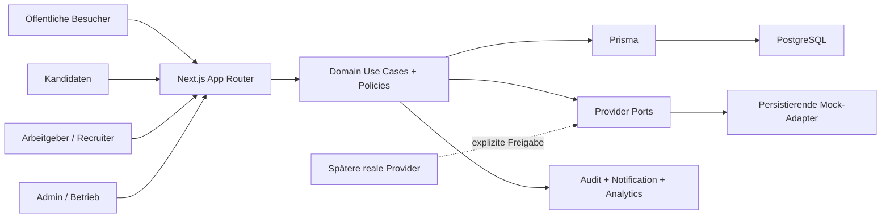

# SwissTalentHub — Architektur-, Daten-, UX- und Betriebsblueprint

> **Planungsstand:** `PortalGERM` enthält zum Zeitpunkt dieses Audits keine Anwendung. Alle Pfade, Modelle und Befehle in diesem Dokument sind Soll-Vorgaben. Der verifizierte Ist-Zustand steht in [repository-audit.md](./repository-audit.md).

## 1. Architekturziele und Leitprinzipien

1. **Vertikale End-to-End-Slices:** UI → Schema-Validierung → Use Case → serverseitige Autorisierung/Ownership → Transaktion → Audit/Notification → Ergebniszustand → Test.
2. **Domainlogik ausserhalb von React:** Server Components laden Daten, Client Components verwalten nur Interaktion; Use Cases und Policies bleiben in `lib/domains/*`.
3. **Default deny:** Route-Schutz ist Komfort, jede Query und Mutation prüft Rolle, Tenant und Objektzugriff erneut.
4. **Privacy by construction:** Talent-Radar-Antworten werden aus allowlist-basierten Selects aufgebaut; private Felder gelangen nie in den Payload.
5. **Nachvollziehbare Zustände:** Prisma-Enume und explizite Transition-Funktionen statt frei geschriebener Statuswerte.
6. **Geld und Credits als Ledger:** Rappen-Integer, Transaktionen, Idempotenzschlüssel und append-only Bewegungen; keine Float-Beträge und kein ungeschütztes `amount--`.
7. **Mocks mit realem lokalem Verhalten:** Adapter produzieren persistierte Orders, Notifications oder Checks; sie sind keine UI-Platzhalter.
8. **Messbarkeit mit Datenminimierung:** Events haben klare Zwecke und enthalten keine Inhalte aus CVs, Nachrichten oder Freitexten.
9. **Operative Beherrschbarkeit:** Moderation, Datenschutzfälle, Importfehler und Billing-Ausnahmen besitzen Queues, Verantwortliche und Auditspuren.
10. **Evolution statt Neubau:** stabile Domain-Schnittstellen, versionierte Scores/Policies, Migrationen und Provider-Ports erlauben spätere reale Integrationen.

## 2. Systemkontext und Laufzeit



### Technischer Basisstack

- Next.js App Router, React, TypeScript `strict`, Tailwind CSS und shadcn/ui;
- Prisma + PostgreSQL; Migrationen sind ab der ersten stabilen Schemafassung verbindlich;
- Zod an jeder externen Eingabegrenze;
- eigene DB-Session mit `httpOnly`, `Secure` in Produktion und `SameSite=Lax` oder strenger;
- Vitest für Unit-/Integrationstests, Playwright für kritische Browserpfade ab P0-Release-Gate;
- strukturierte Logs, Health-/Readiness-Endpunkte und Error Tracking über einen Mock-/Console-Port im MVP.

Die im Quellprojekt verwendeten Versionen (u. a. Next 16/React 19/Prisma 7) sind **Referenz, nicht im Ziel verifiziert**. Phase 01 pinnt kompatible Versionen im Lockfile, liest die installierten Next-Dokumente und hält Abweichungen in [decisions.md](./decisions.md) fest. Shell-Skripte müssen Windows und CI unterstützen; POSIX-only `VAR=value command` ist nicht zulässig.

## 3. Verzeichnis- und Verantwortungsstruktur

```text
app/
  (public)/                  # indexierbare Seiten
  (auth)/                    # Login/Registrierung/Reset-Mock
  candidate/                 # noindex, Candidate-Layout
  employer/                  # noindex, Company-Kontext
  admin/                     # noindex, Plattformbetrieb
  api/                       # nur wo Route Handler statt Server Action nötig ist
components/
  ui/                        # design-system primitives
  shared/                    # universelle, domänenarme Komponenten
  candidate|employer|admin/  # domänenspezifische Präsentation
lib/
  db/                        # Prisma client + Transaktionshilfen
  auth/                      # Session, Password, Route Guards
  validation/                # Zod-Schemata, normalisierte Fehler
  security/                  # CSRF/origin, rate limits, redaction, ids
  domains/
    jobs|applications|companies|talent-radar|billing|boosts|imports|content/
  policies/                  # RBAC, Ownership, Entitlements
  providers/                 # Ports + mocks; keine UI-Imports konkreter Adapter
  privacy|audit|analytics|notifications|search|scoring|utils/
prisma/
  schema.prisma
  migrations/
  seed/                      # thematisch getrennte idempotente Seed-Module
tests/
  unit|integration|e2e|fixtures/
```

Direkte Prisma-Aufrufe sind in Page-Komponenten nur für triviale, bereits autorisierte Read Models erlaubt; bevorzugt werden Query-Funktionen je Domain. Mutationen laufen über Use Cases, damit Policy, Transaktion, Audit und Idempotenz nicht dupliziert werden.

## 4. Rollen-, Tenant- und Berechtigungsmodell

### Globale Rollen

| Rolle | Bedeutung | Darf nicht automatisch |
|---|---|---|
| `CANDIDATE` | eigenes Profil, Bewerbungen, Alerts, Radar-Consent | andere Kandidaten, Firmeninternes oder Admin-Daten lesen |
| `EMPLOYER` | Nutzer mit Firmenmitgliedschaft | ohne Membership auf eine Firma zugreifen |
| `RECRUITER` | Recruiting-Nutzer mit begrenztem Firmen-/Jobkontext | Billing, Ownership, Verifizierung oder fremde Jobs verwalten |
| `ADMIN` | Plattformbetrieb im MVP | Audit umgehen, Success Fee aktivieren, Geheimnisse/CV-Inhalte einsehen |

Eine spätere Trennung in `SUPPORT`, `MODERATOR`, `SALES`, `FINANCE` ist P1. Bis dahin müssen Admin-Aktionen trotzdem in Capability-Funktionen gekapselt sein, damit die globale Rolle nicht überall hartcodiert wird.

### Firmenrollen

| Firmenrolle | Profil | Jobs | Bewerbungen | Team | Billing | Analytics |
|---|---|---|---|---|---|---|
| `OWNER` | schreiben | alle | alle | verwalten; letzter Owner geschützt | verwalten | planabhängig |
| `ADMIN` | schreiben | alle | alle | einladen/entfernen ausser Owner | lesen/kaufen nach Policy | planabhängig |
| `RECRUITER` | lesen | zugewiesen/erstellen nach Policy | zugewiesene Jobs | nein | nein | jobbezogen |
| `VIEWER` | lesen | lesen | anonymisierte/erlaubte Ansicht | nein | nein | planabhängig lesen |

### Autorisierungsreihenfolge

1. Session gültig und User aktiv?
2. Globale Capability erlaubt?
3. Firmenkontext aus serverseitig zulässiger Membership ermittelt?
4. Membership aktiv und Rolle ausreichend?
5. Objekt gehört zur Firma bzw. zum Kandidaten?
6. JobAssignment/Mandat erforderlich und gültig?
7. Plan-/Credit-Entitlement erlaubt?
8. Statusübergang zulässig?

Bei Schritt 3–6 wird für „nicht vorhanden“ und „fremd“ dieselbe 404-Antwort verwendet, um IDOR-Signale zu vermeiden. Gesperrte Nutzer verlieren Sessions; gesperrte Firmen pausieren aktive Stellen in einer Transaktion.

## 5. Informationsarchitektur und Routenvertrag

Jede Zeile ist eine Seitengruppe. Für jede konkrete Route gelten zusätzlich Loading-, Empty-, Error-, Forbidden-, Not-found-, Success-, Locked- und Onboarding-Zustand aus [product-quality-gates.md](./product-quality-gates.md).

### Öffentlich und Auth

| Route(n) | Zweck / Primäraktion | Daten / Servergrenze | Sekundäraktionen und Vertrauen | Mobile |
|---|---|---|---|---|
| `/` | Nutzen verstehen; Stelle suchen | veröffentlichte, nicht abgelaufene Jobs; kuratierte Firmen/Cluster | Salary Radar, Arbeitgeber-CTA, Score-Erklärung, Datenstand | Suche zuerst; Sektionen als kompakte Cards |
| `/jobs` | relevante Stellen filtern | paginierte Search Query, Allowlist-Params, Ranking | Suche speichern, Filter löschen, Alternativen; Boost-Label | Filter-Sheet, sticky Ergebniszahl, keine breite Tabelle |
| `/jobs/[slug]` | entscheiden; bewerben/merken | Published-only Read Model, ScoreSnapshot, Company, Kandidaten-Match optional | teilen, ähnliche Jobs, Meldung; Datenstand/Scorefaktoren | primärer CTA sticky, lange Abschnitte einklappbar |
| `/jobs/kanton/[canton]`, `/jobs/kategorie/[category]`, `/jobs/kanton/[canton]/kategorie/[category]` | Cluster erkunden; Jobabo | Kombination ist P0 für freigegebene Startcluster; jede Route nur indexierbar bei Content-/Liquiditätsgate | lokale Orientierung, Canonical, aktualisierte Jobzahl | Filter/Content priorisiert, keine Textwüste |
| `/companies`, `/companies/[slug]` | Arbeitgeber prüfen | canonical ACTIVE/LIVE validated/sanitized public allowlist + Published Jobs; P0 has no separate profile review, Verification is only the badge/publish trust gate | Profil beanspruchen, Jobs, Verifizierungsstatus | Jobs als Cards |
| `/salary-radar` | Lohnspanne orientieren | validierte Kriterien, versionierte SalaryBand Query | Methodik/Abdeckung, passende Jobs, Ergebnis speichern | schrittweises Formular, Ergebnis sofort sichtbar |
| `/guide`, `/guide/[slug]` | konkrete Karrierefrage lösen | Published Content, Autor/Review/Aktualität | passende Suche/Jobabo; Quellen | lesbare Typografie, Inhaltsanker |
| `/pricing` | Plan verstehen | aktive Version von Plan/Product-Katalog | P0 Monatskonditionen, FAQ, Demo; MWST/Laufzeit; inaktive Jahresforschung nicht rendern | keine abgeschnittene Vergleichstabelle; Featuregruppen |
| `/employers/*` | Arbeitgebernutzen verstehen | kuratierter Content und echte/markierte Beispiele | Demo, erste Stelle, Talent Radar, Import | CTA je Abschnitt, kurze Belege |
| `/employers/demo` | Demo anfragen | rate-limitierte Lead-Mutation + Notification | Datenschutzhinweis, Erfolg/Follow-up | kurzes Formular |
| `/login`, `/register/*`, `/forgot-password`, `/reset-password` | sicher anmelden/onboarden | Auth Use Cases, sichere `next`-Allowlist, hashed single-use Reset, generische Fehler | Rollenwahl, Passwortanforderung, invalid/expired/used Reset | Einspaltig, Passwortmanager-freundlich |
| `/support`, `/support/[id]` | Hilfe anfragen/verfolgen | requester-scoped SupportCase/Event | authenticated intake, bounded text, own-case safe 404 | kurzes Formular + Timeline |
| `/invite/[token]` | Team-Einladung sicher annehmen | hashed single-use CompanyInvitation + Membership transaction | Login/Register resume, matching email, expiry/revoke/seat/Company checks | einspaltige Status-/Bestätigungsseite |

### Kandidat

| Route | Zweck / Primäraktion | Daten / Mutation | Wesentliche Zustände | Mobile |
|---|---|---|---|---|
| `/candidate/dashboard` | nächste sinnvolle Aktion | JobPass-Fortschritt, Alerts, Bewerbungen, Empfehlungen | neue Nutzer: Checkliste; keine Empfehlungen: Such-CTA; offene Antwort | priorisierte Liste statt Kartenfriedhof |
| `/candidate/jobpass` | Profil vervollständigen | Profil/Skills/Sprachen/Präferenzen/CV-Metadaten; autosaved Draft + final validation | unvollständig, gespeichert, Konflikt, Radar-Preview | Abschnitte/Stepper; sticky Save |
| `/candidate/saved-jobs` | gemerkte Stellen vergleichen | Candidate-owned SavedJob Query/Delete | abgelaufen: klar markiert + ähnliche Jobs | Swipe/Overflow-Aktionen zugänglich |
| `/candidate/applications`, `/candidate/applications/[id]` | Status verfolgen/handeln | candidate-owned Application Timeline, withdraw, messages | Empty CTA, withdrawn, job closed, permission-safe 404 | Liste/Timeline statt Kanban als Standard |
| `/candidate/alerts` | Jobabos verwalten | CRUD, Frequenz/Consent, Preview | pausiert, keine Treffer, Zustellfehler-Mock | Card-Liste, Inline Toggle mit Bestätigung |
| `/candidate/messages`, `/candidate/messages/[id]` | kontextbezogen kommunizieren | participant-scoped threads/messages | blockiert, geschlossen, unread, abuse report | Chat mit Kontextkopf; keine horizontale Zweispalte nötig |
| `/candidate/talent-radar` | Opt-in und anonyme Vorschau | Consent + radar-safe fields | off by default, paused, active, incomplete | Feld-für-Feld Vorschau |
| `/candidate/talent-radar/requests`, `/candidate/talent-radar/requests/[id]` | Kontakt annehmen/ablehnen, danach optional Reveal | candidate-owned ContactRequest/Event; Conversation erst nach Accept | pending/expired/cancelled/accepted/declined; Accept zeigt keine Identität | Request Cards + klare getrennte Bestätigungen |
| `/candidate/privacy` | Datenkontrolle | Candidate/User Consent history, ContactRequests, RevealGrants, PrivacyRequests | offene Anfrage, recent-password Mock-Identitätsprüfung, Einschränkungen | klare Bereiche und irreversible Folgen |

### Arbeitgeber und Recruiter

| Route | Zweck / Primäraktion | Daten / Mutation | Permission / Locked | Mobile |
|---|---|---|---|---|
| `/employer/dashboard` | Onboarding/Arbeitsqueue | Company Read Model, usage, jobs, applications, suggestions | Membership; planabhängige Module | Tasks vor Charts |
| `/employer/company` | Profil/Claim/Verification | Company, VerificationRequest, media metadata | Owner/Admin write; Recruiter read | Formularabschnitte, Statusbanner |
| `/employer/company/claim-pending` | bestehenden Firmenbeitritt nachweisen/verfolgen | current User's ClaimRequest only; no Company Read Model/Membership | Employer User; evidence/cancel, Admin decides | generischer Pending/Evidence/Rejected state |
| `/employer/team`, `/employer/team/invitations` | Mitglieder/Rollen | Membership/Invitation Use Cases | Owner/Admin, Seat gate, letzter Owner geschützt | Card-Liste statt Tabelle |
| `/employer/jobs` | Stellen verwalten | company-scoped paginated Jobs | assigned subset for recruiter | Statusfilter-Sheet, row→card |
| `/employer/jobs/new` | Draft erstellen/einreichen | step drafts, score preview, ReportingCheck, submit transition | create permission + quota at publish, not at draft | Stepper mit Resume; Summary vor Submit |
| `/employer/jobs/[id]` | Draft bearbeiten oder publizierte Revision pausieren/klonen, Performance | company/assignment-scoped Job + immutable published Revision/Score | PUBLISHED ist content-read-only; `pauseAndCreateRevision` entfernt Öffentlichkeit und startet Review; role×assignment matrix + audit | Actions im Overflow, Warnungen sichtbar |
| `/employer/applicants`, `/employer/applicants/[id]` | Pipeline bearbeiten | job-scoped Applications/Events/Messages | candidate identity only from application/reveal; assignments | Stage-Filter + Liste; Drag optional, nie einziges UI |
| `/employer/talent-radar` | anonyme Talente suchen/kontaktieren | locked state führt **keine** candidate query aus; safe search when entitled | access + atomic allowance/credit | Filter-Sheet; anonyme Cards |
| `/employer/talent-radar/requests/[id]` | Anfrage/Reveal-Status | company-scoped ContactRequest + permitted RevealGrant | keine Identität vor ACCEPTED+REVEALED | Timeline |
| `/employer/analytics` | Funnel verstehen/verbessern | aggregierte company/job metrics with thresholds | plan levels, suppression for small counts | KPI summaries + funnels, no dense BI |
| `/employer/billing` | Plan/Usage verstehen | subscription, entitlements, ledger summaries | Owner/Admin read; Plan change/cancel Owner only | klare current/next action |
| `/employer/billing/checkout`, `/success` | Mock-Kauf bestätigen | idempotent Order workflow; server-priced | Plan/subscription Owner only; one-time Product Owner/Admin; product eligibility | einspaltige Zusammenfassung |
| `/employer/billing/invoices`, `/usage` | Belege/Nutzung | tenant-scoped Invoice + entitlement/ledger | Owner/Admin; immutable invoice view | Cards/download later |

### Admin und Betrieb

| Route | Arbeitszweck | Hauptaktionen / Daten | Schutz / UX |
|---|---|---|---|
| `/admin` | priorisierte Tagesübersicht | Queue counts, SLA breaches, system health | Capability + Audit; keine Vanity-only-Charts |
| `/admin/jobs`, `/admin/jobs/[id]` | Moderation | approve/request changes/reject/pause, versions, score evidence | Begründung Pflicht, Preview, Confirmation |
| `/admin/companies`, `/admin/companies/[id]` | Verification/Suspension | verification, membership, active jobs, abuse | Suspension transaction + impact preview |
| `/admin/users`, `/admin/users/[id]` | Nutzerstatus/Rollen | suspend/reactivate, sessions revoke | kein Passwort/Token sichtbar; role change audited |
| `/admin/taxonomy` | Kategorien/Kantone/Orte/Codes | CRUD/version/import | Referenzen/Impact vor Delete; prefer deactivate |
| `/admin/reports`, `/admin/reports/[id]` | Missbrauchsfälle | triage, restrict, resolve, notes | sensitive queue, severity/SLA |
| `/admin/imports`, `/admin/imports/[id]` | Feed-Vorschau/Dubletten/Fehler | parse→preview→approve→commit/rollback | source/license, no direct publish by parser |
| `/admin/support`, `/admin/support/[id]` | Supportfälle priorisieren/lösen | triage, assign, request info, resolve/reopen, SLA/Event history | Support-Capability, need-to-know, keine Inhalte in Analytics |
| `/admin/content`, `/admin/content/[id]` | Guide-/Cluster-Content steuern | draft, review, preview, publish/unpublish, revision history | Content-Capability, safe Markdown, SEO gate remains separate |
| `/admin/billing`, `/admin/orders`, `/admin/invoices` | finanzielle Ausnahmen | state inspection, manual mock actions | ledger-first, idempotent; no silent edits |
| `/admin/plans`, `/admin/products` | Katalogversionen | create version, schedule activation, deactivate | existing contracts not rewritten |
| `/admin/leads`, `/admin/leads/[id]` | Sales-Follow-up | assign task, outcome, next date | consent/purpose, access scoped later |
| `/admin/business-cockpit` | Aktionen aus Signalen | accept/dismiss/assign recommendation | Evidenz + Zeitraum + Outcome required |
| `/admin/privacy-requests` | Export/Delete-Mock bearbeiten | verify, export manifest, status | least privilege, immutable evidence |
| `/admin/audit`, `/admin/system` | Untersuchung/Betrieb | filters, correlation id, provider/queue health | redacted metadata, retention policy |

### Systemrouten

`/sitemap.xml`, `/robots.txt`, `/health/live`, `/health/ready` sowie gezielte Route Handler unter `/api/*`. Private Layouts exportieren `robots: { index: false, follow: false }`; Sitemap und Analytics dürfen keine privaten oder anonymen Radar-Daten enthalten. Token-/Case-/Order-sensitive Routen ausserhalb der privaten Layouts (`/reset-password`, `/invite/[token]`, `/support/[id]`, `/alerts/unsubscribe/[token]`, `/mock/checkout/[orderId]`, non-production `/dev/mailbox`) sind explizit dynamisch, `Cache-Control: private, no-store`, `robots: noindex,nofollow`, mit strikter Referrer-Policy und generischer/safe-404 Antwort; Tests prüfen Header und dass Token/ID nie in Log, Canonical oder Referrer erscheint.

## 6. Domänenmodell und zentrale Invarianten

### Identity und Tenant

- `User`, `Credential`, `Session`, `PasswordResetToken` (Mock), `UserStatus`.
- `Company`, `CompanyStatusEvent`, `CompanyMembership/Event`, `CompanyInvitation/Event`, `CompanyClaimRequest/Event`, `CompanyVerificationRequest/Event`, `CompanyBillingProfile`.
- Unique: normalisierte `User.email`; `(companyId,userId)` Membership; gehashter Invitation Token; mindestens ein Owner pro aktiver Firma.

### Kandidat

- `CandidateProfile`, `CandidateSkill`, `CandidateLanguage`, `CandidatePreference`, `CandidateDocumentMetadata`.
- `CandidateOnboardingEvent` records the explicit complete/reopen projection; percentage is display only.
- `CandidateConsent` ist append-only/versioniert; aktueller Zustand ableitbar.
- `RadarProfile` enthält nur explizit freigegebene, nicht identifizierende Projektionen. `RadarOpaqueMapping` hält zufällige, Company+30-Tage-Epoch-scoped Listing Tokens als Lookup-HMAC + verschlüsselten Token; `RadarSearchBudget/Session/Candidate` persistiert den Kohorten-/Enumerationsschutz. Es gibt keinen globalen oder stabil öffentlichen Radar-Identifier.
- `PrivacyRequest/Event`, typed Correction rows und `PrivacyIdentityChallenge` bilden Export/Delete/Correction-Mock mit Version, Frist, recent-password Owner-Challenge, need-to-know Assignment und geschlossenem Outcome ab.

### Firmen, Jobs und Content

- `Job`, `JobRevision`, `JobScoreSnapshot`, `JobStatusEvent`, `JobReportingCheck`, `JobAssignment`, `JobViewAggregate`.
- `Category`, `Canton`, `City`, `OccupationCodeVersion`, `SalaryDatasetVersion`, `SalaryBand`, `ContentPage` + immutable `ContentRevision` + `ContentEvent`. Das ist ab P0 die einzige Quelle für reviewed Guide-/Cluster-Content.
- Job-Slug unique/stabil; Firma und Quelle immer vorhanden; veröffentlichter Inhalt besitzt Moderationsrevision, `publishedAt`, zwingend nicht-null/gebundenes `expiresAt` und Score-Version. `Job.expiresAt`, published Category/Canton/City and Salary Period/Min/Max are indexed read projections of the current published Revision and are copied only in the same Publish/Reactivation use case; drift constraints/tests prevent competing truths.

### Bewerbung und Kommunikation

- `SavedJob`, `JobAlert/Event/Digest/DigestItem/UnsubscribeToken`, `Application`, immutable `ApplicationSubmissionSnapshot/Document`, `ApplicationEvent`, `Conversation`, `ConversationParticipant`, `Message`, `Notification`.
- Unique Bewerbung `(jobId,candidateProfileId)` für nicht historisierte Bewerbung; Statusänderung schreibt immer Event.
- Submission stores the exact submitted Revision/recipient/identity/response/doc/notice snapshot and transactionally creates exactly one Application Conversation (`applicationId @unique`) with Candidate + Company principals. Nachrichten sind nur für Thread-Teilnehmer; Analytics erhält keine Nachrichtentexte.

### Talent Radar und Privacy

- `EmployerContactRequest`, `ContactRequestEvent`, `IdentityRevealGrant` + typed encrypted snapshot `IdentityRevealGrantField` + append-only Confirmation, `AbuseReport`.
- Contact Request referenziert nur intern Candidate plus immutable cluster/funding snapshots. The Company-scoped listing token is resolved/rechecked at creation but is never stored or reused as history/authorization. Serverantwort verwendet Safe DTO.
- Reveal gilt für genau `candidateId + companyId + contactRequestId/conversationId`, ist kandidateninitiiert, one-Grant-per-request, snapshots the exact confirmed values under a versioned dedicated key and is explicitly revocable for future reads.

### Monetarisierung

- `Plan`, `PlanVersion`, typed `PlanEntitlement`, `Product`, `ProductVersion`.
- `EmployerSubscription`, `SubscriptionEvent`, `SubscriptionChangeSchedule`, global `EntitlementGrant`; targeted P1 products use separate `AdditionalJobPermit` and `ImportAccessGrant` and never enter the global resolver.
- `CreditAccount`, `CreditLedgerEntry`, `JobBoost`, `Order`, `OrderLine`, `PaymentEvent`, `Invoice`, `InvoiceLine`.
- Jede OrderLine referenziert genau eines von PlanVersion/ProductVersion (XOR), besitzt ihren eigenen typisierten Fulfillment-Kontext und Preis-/Steuersnapshot; JobBoost referenziert genau die finanzierende Line oder Ledger-Bewegung. Preise und vollständige Billing-Adresse werden bei Order/Invoice als Snapshot gespeichert; spätere Katalog-/Profiländerung verändert alte Belege nicht.
- Ledger-Summe statt ungeschütztem mutable Balance; unique `idempotencyKey` je Fulfillment/Verbrauch.

### Betrieb, Import und Messung

- `ImportSource`, `ImportRun`, `ImportItem`, `ImportDecision`, P1 `ImportSetupApproval`, `SupportCase`, `SupportCaseEvent`, `SalesLead`, `SalesActivity`; P1 `ReferralLink`, `ReferralAttribution`, `RecruiterMandate/Event`.
- `AuditLog`, `AnalyticsEvent`, `MetricDaily`, `EmailLog`, `SystemTask`.
- AuditLog enthält Actor, Capability, Target Type/ID, Company Scope, Result, Reason Code, Correlation ID, redigierte Metadata und Timestamp; niemals Geheimnisse oder CV-/Nachrichteninhalt.

### Pflichtindizes

Zusätzlich zu Unique-Constraints mindestens zusammengesetzte Indizes für:

- `Job(status,publishedAt)`, `Job(companyId,status)`, `Job(publishedCategoryId,publishedCantonId,status)`, `Job(publishedSalaryPeriod,publishedSalaryMin,publishedSalaryMax,status)`, `Job(expiresAt,status)`;
- `Application(jobId,status,updatedAt)`, `Application(candidateProfileId,updatedAt)`;
- `CompanyMembership(userId,status)`, `JobAssignment(userId,jobId)`;
- `EmployerContactRequest(companyId,status,createdAt)`, `IdentityRevealGrant(companyId,candidateProfileId)`, `RadarOpaqueMapping(companyId,lookupHmac,epoch)`, `RadarSearchBudget(companyId,calendarDate,filterHash)`;
- `EmployerSubscription(companyId,status,currentPeriodEnd)`, `CreditLedgerEntry(accountId,createdAt)`;
- `Order(companyId,status,createdAt)`, `Invoice(companyId,status,issuedAt)`;
- `AuditLog(companyId,createdAt)`, `AuditLog(actorUserId,createdAt)`;
- `ImportItem(runId,status)`, `AnalyticsEvent(kind,occurredAt)`.

Indexentscheidungen werden mit `EXPLAIN` an realistischen Seed-Mengen überprüft; unbounded List Queries sind untersagt.

## 7. Statusmaschinen und Transaktionsgrenzen

### Job

The closed Job machine is actor-bound: Owner/Admin or Recruiter-EDITOR creates `DRAFT`; EDITOR/Owner/Admin performs `DRAFT|CHANGES_REQUESTED → SUBMITTED`; Platform Reviewer performs `SUBMITTED→IN_REVIEW` and `IN_REVIEW→CHANGES_REQUESTED|APPROVED|REJECTED`; Platform Publish performs `APPROVED→PUBLISHED` through current verification/quota. Owner/Admin may do unchanged `PUBLISHED→PAUSED→PUBLISHED`, or material edit via `pauseAndCreateRevision` (`PUBLISHED→PAUSED→DRAFT`) / `createRevisionFromPaused` (`PAUSED→DRAFT`), which clones immutable published evidence and removes public visibility throughout ordinary `DRAFT→SUBMITTED→IN_REVIEW→APPROVED→PUBLISHED`. `IN_REVIEW→REJECTED` requires reason; only idempotent clone performs `REJECTED→DRAFT`. Owner/Admin may close `PUBLISHED|PAUSED|EXPIRED→CLOSED`; system performs `PUBLISHED→EXPIRED`; Import rollback alone performs untouched `DRAFT→REMOVED`. `CLOSED|REMOVED` are terminal. Every edge has optimistic current-Revision/version check, event/Audit and role×assignment tests; no parallel public+pending truth exists.

### Company und Verification

- Company: Registration creates `DRAFT`. Owner/Admin `completeCompanyOnboarding` validates name, industry, size, website or UID, primary CH location and public description, then writes `DRAFT → ACTIVE` + event. `ACTIVE ↔ SUSPENDED → CLOSED`; Reaktivierung ist explizit, Schliessen terminal. Verification is orthogonal and never a Company Boolean.
- VerificationRequest: within one request `DRAFT → PENDING → CHANGES_REQUESTED → PENDING → VERIFIED|REJECTED`; `REVOKED` may follow `VERIFIED` only by Admin with reason. After `REJECTED|REVOKED`, a resubmission creates a new request identity with `supersedesRequestId`; at most one open `DRAFT|PENDING|CHANGES_REQUESTED` cycle exists per Company. Badge is absent unless the latest applicable cycle is currently `VERIFIED`. Publication requires Company `ACTIVE` plus current verified evidence.

### Candidate onboarding

Registration creates `DRAFT`. `completeCandidateOnboarding` requires first/last name, canton, at least one desired title or category, at least one Skill, at least one Language, valid workload min/max, RemotePreference and at least one JobType; salary, phone, CV, permit, summary and Radar opt-in stay optional. It writes `DRAFT → COMPLETE` + event. Removing a required value transactionally writes `COMPLETE → DRAFT`, withdraws the derived RadarProfile while preserving consent history and requires explicit re-completion. Application is independent: a Draft Candidate may apply after confirming the recipient payload (first/last name and User email plus job-specific fields); Radar search eligibility requires `COMPLETE` **and** current consent.

### Application

Candidate may perform `SUBMITTED|IN_REVIEW|SHORTLISTED|INTERVIEW|OFFER → WITHDRAWN`. Authorized Company Pipeline actors perform only `SUBMITTED→IN_REVIEW`, `IN_REVIEW→SHORTLISTED|REJECTED`, `SHORTLISTED→INTERVIEW|REJECTED`, `INTERVIEW→OFFER|REJECTED`, `OFFER→HIRED|REJECTED`. `WITHDRAWN|REJECTED|HIRED` are terminal; skip/backtrack is denied, Rejected requires a typed reason, and same-target retry is event-free idempotence. Every accepted edge appends Event/Notification/Audit atomically and the actor×from×to matrix is exhaustively tested.

### Contact Request

`PENDING → ACCEPTED|DECLINED|EXPIRED|CANCELLED`; P0 expiry is exactly 14 days (`createdAt <= now < expiresAt`) and a current pending request blocks a duplicate from the same Company/Candidate. Manual cancel belongs only to the requesting Company; the canonical Candidate/User/Company eligibility-loss transaction may instead system-cancel affected pending requests with its closed reason and both-party notification. `ACCEPTED` alone creates Conversation; only a later candidate-initiated typed RevealGrant supplies identity. A consumed allowance/credit is never automatically refunded for decline, expiry or either cancellation path; an Admin reversal requires referenced Ledger reversal, reason and audit. Recontact after `DECLINED|EXPIRED|CANCELLED` has a 30-day cooldown from terminal event; after ACCEPTED it uses the Conversation rather than a new request. Expiry is projected by an idempotent maintenance command, never a public GET.

### Order / Subscription / Invoice

- Order: `DRAFT → PENDING → PAID|FAILED|CANCELLED|EXPIRED`; Fulfillment nur von `PAID`, genau einmal.
- Subscription: new paid row is `ACTIVE`; a downgrade successor is `SCHEDULED→ACTIVE` exactly at its start. Pending CANCEL schedule projects current `ACTIVE→CANCELLING→CANCELLED`; natural non-renewed lapse is only `ACTIVE→EXPIRED`; replaced/downgraded old row becomes `EXPIRED`. `SubscriptionChangeSchedule` is canonical, there is no `cancelAtPeriodEnd` field, Company has 0..n history but at most one effective row/one pending schedule.
- Invoice: `DRAFT → ISSUED → PAID|VOID`; Refund/Credit Note ist P2 und darf nicht durch Rücksetzen auf `DRAFT` simuliert werden.

### Atomare Use Cases

- Job publizieren/reactivieren: approved revision with required `now < validThrough <= now+90d` + Company ACTIVE/VERIFIED/no restriction → lock Company quota scope → count `PUBLISHED && publishedAt<=now && now<expiresAt` → `canPublishJob` with optional exact-target AdditionalJobPermit → copy all published Revision projections → status/event/audit. Approved/pending/paused/expired/closed/removed Jobs do not consume quota; exact expiry boundary stops consumption without a GET write. All public/search/alert/apply consumers call the same full public-eligibility helper.
- Kontakt anfragen: entitlement/allowance → ledger consume → request → notification/audit.
- Mock-Zahlung bestätigen: deterministic provider confirmation → one DB transaction for Order/PaymentEvent/Invoice/fulfillment/audit → notification after commit/outbox.
- Firma sperren: Company status → aktive Jobs pause → Sessions/Access policy → Audit.
- Identität freigeben: Candidate ownership → accepted request → explicit confirmation version → grant → safe notification/audit.

## 8. Server Actions, Route Handler und Validierung

### Entscheidung

- Server Actions für formularnahe, same-origin Mutationen.
- Route Handler für Provider-ähnliche Callbacks/Mock-Checkout, exportierbare Ressourcen, Health und später Webhooks.
- Beide rufen dieselben Domain Use Cases auf; keine doppelte Businesslogik.

### Mutation Contract

Jede Mutation akzeptiert ein Zod-validiertes Command DTO plus serverseitig erzeugte Actor-/Tenant-Daten. Sie liefert ein diskriminiertes Ergebnis wie `OK | VALIDATION | FORBIDDEN | CONFLICT | LIMIT | RATE_LIMITED | NOT_FOUND`. UI erhält de-CH-Texte aus einem zentralen Mapping; interne Details bleiben in redigierten Logs.

### Validierungsregeln

- Feldlängen und normalisierte Strings; keine freien Statuswerte;
- IDs syntaktisch prüfen, aber Ownership separat prüfen;
- Geld/Kontingente niemals vom Client übernehmen; Product/Plan serverseitig laden;
- sichere Redirect-Allowlist; keine externen `next`-URLs;
- Dateien im MVP nur als Metadaten-Mock: erlaubte MIME-Types, Maximalgrösse, Dateiname normalisieren, kein Pfad/Byte-Upload;
- XML/JSON mit Grössen-/Datensatz-/Tiefe-Limit, sichere Parserkonfiguration und Vorschau vor Commit. CSV ist im P0 ausdrücklich nicht unterstützt.

## 9. Fair-Job-Score, Match-Score und Ranking

### Fair-Job-Score v2

Der Score bewertet **beobachtbare Inserattransparenz**, nicht Budget oder Firmenstatus. Die Gewichte sind der eingefrorene P0/v2-Baseline-Vertrag:

| Faktor | Punkte | Evidenz |
|---|---:|---|
| Lohnband + Zeitraum/Währung | 25 | strukturierte Felder, plausibles Min≤Max |
| Aufgaben und Anforderungen konkret | 15 | Mindeststruktur, keine Keyword-Menge als Qualitätssignal |
| Pensum/Vertragsart/Start klar | 15 | strukturierte Felder |
| Arbeitsort + Remote/Hybrid klar | 10 | strukturierte Policy |
| Bewerbungsprozess/Aufwand klar | 10 | Schritte/Unterlagen |
| Antwortziel | 10 | Zusage + später tatsächliche Evidenz separat |
| Benefits konkret | 5 | keine leeren Marketingphrasen |
| Inklusion/Barriere-/Kontaktinfo | 5 | strukturierte Angaben |
| Ablauf/Aktualität | 5 | gültiges Datum |

Die exakten Evidenzprädikate sind bindend in Phase 03: Tasks `PARTIAL=8`, Antwortziel nur integer `1..30`, Benefits ab zwei, freshness mit injiziertem `now` und `now < validThrough <= now+120 Tage`; alle übrigen Tabellenfaktoren erhalten nur bei der dort definierten validen Evidenz ihre vollen Punkte. Unternehmensverifizierung erscheint als separates Badge. `scoreVersion`, Faktoren, Gründe, Verbesserungsvorschläge und Input-Snapshot werden gespeichert. Änderungen erzeugen einen neuen Snapshot. Boost/Plan/Product sind keine Funktionsparameter und werden durch Tests ausgeschlossen.

### Match-Score v1

- Kandidatenseitige Entscheidungshilfe im P0; keine automatische Ablehnung.
- Frozen weights: Skills 30, Sprache 15, Region/Mobilität 15, Pensum 15, Lohnband 10, Jobtyp 5, Remote 5, Verfügbarkeit 5. Normalisierung, Overlap, CEFR-/Remote-/Salary-/Availability-Grenzen, Missing-Data-Denominator, Half-up-Rundung und reason codes stehen exakt in Phase 03 und werden über Fixture-Hash versioniert.
- Keine Alter-, Geschlechts-, Herkunfts-, Gesundheits-, Familien-, Foto-, Namens- oder sonstigen geschützten/proxy-sensitiven Merkmale.
- Fehlende Daten senken Konfidenz, nicht automatisch Eignung; UI zeigt Score und Konfidenz getrennt.
- Arbeitgeberansicht oder Sortierung erst P1 nach Consent-, Bias- und Rechtsprüfung.

### Suche und Boost-Ranking

1. Public-/Query-/Filter-Relevanz ausschliessen/berechnen;
2. Search first-page Sponsored IDs aus aktiven relevanten Boosts by `(relevanceTier,relevanceScore,Fair,date,id)`, maximal 3; Homepage separate maximal 2;
3. organischer Rest in der **vom Nutzer gewählten** Sortierung (Relevanz, Datum, Lohn, Fair oder Response) mit deren definiertem vollständigem Tuple;
4. stabile Tie-Breaker und signed cursor containing query/config/ranking time, sponsored IDs and organic tuple; later pages exclude the first sponsored IDs even after expiry and never replenish.

Boosts dürfen irrelevante Jobs nicht vor relevante Filterresultate setzen. Cursor/Pagination muss dieselbe Sortiertupel-Logik verwenden. P0 kann Prisma-Filter plus In-App-Relevance bei begrenzter Kandidatenmenge nutzen, muss aber vor Pagination korrekt ranken; andernfalls ist eine SQL-Query oder gespeicherte Search-Vector-Lösung nötig.

## 10. Billing, Entitlements und Credits

- `getEffectiveEntitlements(companyId, at)` ist die einzige zentrale Leseschnittstelle: vollständige Default-Free-PlanVersion → genau eine effektive Subscription ersetzt die gesamte Planbasis → aktive typisierte Grants heben/ersetzen/addieren nur nach erlaubter Key-Semantik. Unknown/mistyped/missing/ambiguous keys fail closed. Planrechte und spendable Ledger-Salden nach Funding Source bleiben getrennt; Credits gewähren nie Radar-Zugang.
- Plan-, Product- und approved Tax-Versionen use half-open `[validFrom,validTo)` ranges with database-backed non-overlap per stable identity/jurisdiction. `getEffective*(_, at)` requires exactly one eligible version or fails closed; adjacent versions switch at the exact boundary. Subscription/Order holds the selected immutable version and price/tax snapshot.
- Credit-Verbrauch verwendet DB-Transaktion und atomare Ledger-Bedingung. Tests simulieren parallele Requests gegen eine echte Testdatenbank.
- `BILLING_POLICY_V1` (ADR-028) is binding: plan grants expire at exclusive period end/no rollover; purchased packs at +12 Zurich calendar months; Admin grants require ≤12-month `validTo`; source order is Plan→Purchased→Admin and then earliest expiry/oldest/id under lock. Decline/expiry/cancel has no auto-refund; exact Admin reversal only.
- Boost-Checkout enthält den `jobId` als serverseitig validierten Fulfillment-Kontext; ein allgemeiner Produktkauf ohne zulässigen Job darf keinen JobBoost erzeugen.
- VAT is rounded per InvoiceLine by `vatRappen = roundHalfUp(netRappen × rateBasisPoints / 10_000)`; Invoice totals are sums of line snapshots and are never independently re-rounded (ADR-028).
- Confirm-Mock-Payment gehört der Billing-Domain (Phase 12), Admin kann denselben Use Case nur mit Capability und Audit auslösen. Phase 11 implementiert keine konkurrierende Zahlungslogik.

## 11. Security- und Privacy-Architektur

### Bedrohungsfokus

| Risiko | Prävention | Verifikation |
|---|---|---|
| Cross-Tenant/IDOR | scoping by company/candidate in Query, object-level policies, safe 404 | Integrationstests mit zweiter Firma/Kandidat |
| Talent-PII-Leak | Prisma `select` allowlist, Safe DTO, opaque IDs, response snapshot test | Payload-Tests, Log-/HTML-Suche nach Canary-PII |
| Privilege escalation | global + membership + assignment + capability | Rollenmatrix-Tests |
| CSRF/unsafe mutation | SameSite, Origin/Host-Prüfung, POST/Server Action tokens where needed | negative origin tests |
| Credential attack | Argon/bcrypt, generische Fehler, rate limit, session rotation/revocation | auth unit/integration tests |
| XSS/content injection | plain text/strict sanitization, CSP nonce, no raw HTML | malicious fixture + browser CSP check |
| Credit/payment race | transaction, ledger, unique idempotency key | concurrent DB integration test |
| Import attack | safe parser, size/depth limits, preview/commit separation | malicious XML/JSON fixtures; CSV denied |
| Sensitive logging | central redaction + log schema | automated secret/PII canary test |
| Enumeration | opaque IDs, consistent 404/auth messages, bounded search | negative tests/rate limit |

### Privacy-Lebenszyklus

- Dateninventar mit Zweck, Rechtsgrund-Hypothese, Quelle, Empfänger, Aufbewahrung und Löschregel wird vor Produktionsbetrieb juristisch geprüft.
- Consent ist granular und versioniert; Service-Erfüllung und Marketing werden getrennt.
- Export-Mock erzeugt Manifest/Status, noch keine ungeschützte Downloaddatei.
- Delete-Mock kennzeichnet Abhängigkeiten und gesetzliche Aufbewahrungsgrenzen; echte Löschung/Anonymisierung erst nach Policy/Legal Review.
- Reveal-Dialog nennt Empfängerfirma und einzelne Felder. Bereits übermittelte Informationen können nicht technisch „zurückgeholt“ werden; dies steht klar im UI.

### Header und Plattformschutz

CSP mit per-request Nonce, `frame-ancestors 'none'`, `X-Content-Type-Options: nosniff`, strikte Referrer Policy, Permissions Policy und HSTS nur unter HTTPS. CSP wird mit Next-Build und Hydration verifiziert; niemals ungetestet pauschal `unsafe-inline` für Scripts hinzufügen.

## 12. Mock-Provider und spätere Integration

Nur Payment, Email, Storage, Job-Room, AI und Commute sind externe Provider-Ports. Analytics-Validierung/Aggregation und der HTML-Rechnungsrenderer bleiben interne Domain-/Application-Services; es gibt im P0 weder `AnalyticsProvider` noch `InvoiceProvider`.

| Port | P0 Mock-Verhalten | Persistenz | Reale Integration: zusätzliche Gates |
|---|---|---|---|
| Payment | Checkout-Page, bestätigbarer Erfolgs-/Fehlerfall | Order/PaymentEvent/Invoice/Fulfillment | Webhook-Signatur, Idempotenz, PCI-Scope, Refund/Dunning |
| Email | Template rendern und Zustellung simulieren | Notification/EmailLog | DPA, Domain, Bounce/Complaint, unsubscribe |
| Storage | nur validierte Metadaten | DocumentMetadata | Malware Scan, signed URLs, Region, Retention |
| Job-Room | versionierte OccupationCode-Liste | ReportingCheck + DatasetVersion | offizieller Vertrag/API, jährliches Update, Monitoring |
| AI | deterministische Textvorschläge, nie Entscheidung | Prompt-/Rule-Version ohne sensible Inhalte | DPIA/Legal, DPA, Evaluation, Human Review |
| Commute | deterministische Distanzklasse/aus | optional Cache | Kartenlizenz, Standortminimierung |

Interne Analytics persistiert `AnalyticsEvent/MetricDaily`; eine spätere Drittanbieter-Weitergabe braucht ein separates Product/Privacy/Vendor-Review. Die interne HTML-Rechnungsansicht rendert ausschliesslich den immutable Invoice Snapshot; PDF/A, Archivierung und Steuer-/Nummernprüfung sind ein eigenes späteres Gate, kein Adapter-Swap.

Provider-Auswahl erfolgt in Composition Root/Config, nicht durch UI oder ungeprüfte Env-Automatik. Kein Real-Adapter wird als „bereit“ bezeichnet, solange Sicherheits-, Rechts-, Betriebs- und Failure-Mode-Tests fehlen.

## 13. UX-System und visuelle Qualität

### Seitenaufbau

Jede wichtige Seite hat: präzisen Seitentitel/Nutzen, eine primäre Aktion, maximal zwei sichtbare sekundäre Aktionen, Status-/Vertrauenshinweis, datenbasierte Hauptfläche und kontextuelle Hilfe. Dashboards beginnen mit Arbeitsqueue oder Onboarding, nicht mit dekorativen KPI-Karten.

### Zustandsvertrag

| Zustand | Standard |
|---|---|
| Loading | Skeleton in endgültiger Geometrie; Aktion verhindert Doppelsubmit |
| Empty | erklärt Ursache, zeigt eine relevante nächste Aktion und ggf. Beispiel **klar als Beispiel** |
| Validation | Feldfehler de-CH, Eingaben bleiben erhalten, Fokus zum ersten Fehler |
| Conflict | nennt geänderten Zustand und bietet Refresh/erneuten Versuch |
| Forbidden/Locked | unterscheidet fehlende Rolle von Planlimit; keine Daten hinter Blur laden |
| Error | sichere Nachricht + Korrelations-ID; Retry nur wenn idempotent |
| Success | bestätigt persistierten Zustand, nennt nächste Aktion und relevante Wirkung |
| Onboarding | Fortschritt, optional/erforderlich, fortsetzbar |
| Offline | keine falsche Erfolgsanzeige; Entwurf lokal nur bei klarer Datenpolitik |

### Mobile und Barrierefreiheit

- 360 px ist Mindestbreite; Tabellen werden Cards oder fokussierte Listen, Kanban hat eine Statusfilter-/Listenalternative.
- Filter als Sheet, primäre Aktionen erreichbar, Touch-Ziele ≥ 44 px als Designziel.
- Semantik, Labels, Fehlermeldungsbeziehungen, sichtbarer Fokus, Keyboard-Dialoge, Skip Link, Kontrast und reduzierte Bewegung.
- Desktop-/Mobile-Screenshots je kritischer Route im Release-Audit; Axe oder gleichwertige automatisierte Checks plus Tastatur-Smoke.

### Visuelle Sprache

Ruhige Typografie, grosszügiger Weissraum, wenige funktionale Akzentfarben, klare Statusfarben mit Text/Icon, originale de-CH-Copy und echte Datenhierarchie. Keine kopierte Portalästhetik, keine dichte Admin-Template-Seitenleiste als einziges Produktbild.

## 14. Test- und Verifikationsstrategie

### Testpyramide

- **Unit:** Scores, Statusübergänge, VAT/Rappen, Entitlements, Ranking-Tupel, anonymisierte DTOs, Zod.
- **DB-Integration:** Ownership, Transaktionen, paralleler Credit-/Quota-Verbrauch, idempotentes Fulfillment, Suspension, Import-Commit/Rollback.
- **Route/Action Integration:** Auth, CSRF/Origin, sichere Fehler, Read Models und Audit/Notification.
- **E2E:** vier Kernrollen; Suche→Bewerbung, Employer Draft→Moderation→Pipeline, Limit→Checkout, Radar Contact→Reveal, Admin Suspension.
- **Nichtfunktional:** Accessibility, mobile Viewports, CSP/Headers, `EXPLAIN`, Seed-Idempotenz, Backup-Restore-Probe vor Launch.

### Beweisstandard

Jede Phase dokumentiert Datum, Commit, Umgebung, Befehl, Exit-Code, relevante Zählung/Assertion und bekannte Einschränkung. Ein vorhandenes File oder `[x]` ist kein Nachweis. Security-/Billing-/Privacy-Atomicität kann nicht ausschliesslich mit Mocks ohne Datenbanktest abgenommen werden.

### Zielbefehle

```powershell
npm ci
npm run db:generate
npm run db:migrate
npm run db:seed
npm run lint
npm run typecheck
npm test
npm run test:integration
npm run test:e2e
npm run build
```

Die Skripte kapseln plattformspezifische Env-Syntax. Exakte erwartete Resultate stehen je Phase; Datenbankbefehle laufen gegen eine dedizierte lokale/CI-Testdatenbank, nie gegen unbekannte Produktionsdaten.

## 15. Deployment, Observability, Backup und Skalierung

### Umgebungen

- Local, CI, Preview, Staging und Production mit getrennten Datenbanken/Secrets.
- Seed-Demo nur Local/CI/Preview/Test; Production/Staging-Seeding verweigert Demo-Konten und Demo-Marktplatzdaten. Publicly renderable Company/Job/Content and actor User rows carry/inherit `DataProvenance`; DEMO/TEST is excluded from Production/public market evidence and SEO. Local/CI/Preview fixtures render an unmistakable persistent „Demo-Daten“-banner/badge on every user-visible page/read model containing them; tests reject an unlabeled response.
- Migrationen laufen als expliziter Release-Step; kein `db push` in Production.

### Release-Gate

Lockfile-reproduzierbarer Build, Migration dry-run, Tests grün, Security-Headers geprüft, Smoke gegen Staging, offene P0-Auditpunkte = 0, Rollback-/Restore-Anweisung vorhanden. Mock-Provider und rechtliche Platzhalter verhindern weiterhin die Bezeichnung „produktionsbereit“.

### Observability

- strukturierte Logs mit `requestId`, `correlationId`, Actor-Pseudonym, company scope, route/use case, duration, result code;
- Metriken: Error-/Latency-Rate, DB Pool, Queue Age, Import Failures, Notification Failures, Checkout Conflicts, rate limits;
- Alarmhypothesen und Runbooks für Auth-Ausfall, Cross-Tenant-Verdacht, Zahlungs-/Ledgerfehler, Datenbankausfall und Importspike;
- Sensitive-Data-Redaction automatisiert testen.

### Backup/Recovery

P1 pre-Production backup contract: a dedicated runner streams `pg_dump --format=custom --no-owner --no-acl` directly to `age -r "$BACKUP_AGE_RECIPIENT"`, writes only `.dump.age` plus SHA-256 ciphertext checksum, and fails/cleans any partial ciphertext atomically; no plaintext dump touches persistent disk or logs. The X25519 public recipient may be configured in Ops, while the private identity is held outside repo/runtime backup host in the approved secret manager with two-person recovery access. Quarterly restore uses an isolated empty database and `age --decrypt -i <ephemeral-secret-file> backup.dump.age | pg_restore --exit-on-error --clean --if-exists --no-owner --dbname <isolated-url>`; the ephemeral identity file/DB are destroyed after checksum/schema/row-count assertions and the drill is audited. Retention target is 30 daily + 12 monthly encrypted objects; lifecycle deletion is storage-managed. RPO ≤24 h/RTO ≤8 h remain hypotheses requiring business approval before Production.

### Skalierungspfad

1. Cursor-Pagination, Indizes, `select`-Disziplin, Cache nur für öffentliche, nicht sensitive Reads.
2. Outbox/Worker für E-Mail, Alerts, Statusprojektion, Imports und Aggregation statt manueller Maintenance-Commands bei realem Betrieb.
3. Postgres Full Text/GIN oder Suchservice erst nach Query-/Volumenbeleg.
4. Read Models/Aggregate Tables für Cockpit statt teurer Live-Aggregationen.
5. Objektstorage/CDN und reale Provider erst nach expliziten Gates.

## 16. Architektur-Definition-of-Done

Eine Funktion ist nur fertig, wenn Datenmodell/Migration, validierter Use Case, serverseitige Policy, Transaktion/Idempotenz, Audit/Notification, alle UX-Zustände, Mobile/A11y, realistische Seeds, relevante Unit-/Integration-/E2E-Tests, Observability und Dokumentation nachweisbar zusammenarbeiten. „Im Plan“, „Datei vorhanden“ oder „UI klickbar“ genügt nicht.
