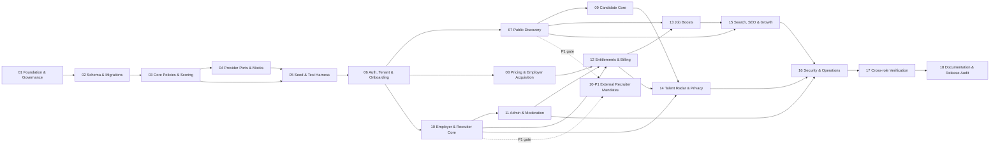

# SwissTalentHub — Ausführbarer Implementierungsplan

> **Verbindlicher Startpunkt für Coding-Agenten.** Der Zielzustand ist ein kontrollierbares, DSG-freundlich vorbereitetes MVP mit persistierenden Mock-Providern, nicht ein produktionsbereites System. Jeder Schritt wird vollständig abgeschlossen, bevor ein abhängiger Schritt beginnt. Unit-/Integrationstests entstehen in der besitzenden Phase; Phase 17 konsolidiert und erweitert sie.

## Ausführungsregeln

1. Vor jedem Schritt: [AGENTS.md](../AGENTS.md), [99-rules-quickref.md](./99-rules-quickref.md), [decisions.md](./decisions.md), [requirements-matrix.md](./requirements-matrix.md) und die zugehörige Phasendatei lesen.
2. Keine geerbten `[x]`: Ein Häkchen braucht Evidence mit Datum, Commit, Umgebung, Befehl/Manual Check, Ergebnis und Limitation.
3. Jede Mutation folgt: Zod → Session → Capability → Tenant/Ownership → Entitlement/Status → Transaktion → Audit/Notification → Safe Result.
4. Schemas werden über Migrationen entwickelt; `db push` ist nur für wegwerfbare lokale Experimente zulässig.
5. Ein Schritt ist erst fertig, wenn sein vertikaler Nutzerfluss mit realer Testdatenbank funktioniert. Dateien, UI oder Mockobjekte allein sind kein Done.
6. Scope-Änderungen erhalten Requirement-ID und ADR/Audit-Eintrag, bevor Code stillschweigend abweicht.

## Abhängigkeiten

---

## 01 — Foundation, Repository-Governance und reproduzierbare Toolchain

**Ziel und Begründung:** Aus dem Planungsrepository einen reproduzierbaren, plattformneutralen Next.js-Skeleton machen. Ohne Lockfile-, Script-, Env- und Evidence-Disziplin ist jede spätere Abnahme unzuverlässig.

**Abhängigkeiten:** fachlich freigegebene Planrichtung; ADR-012/015/016 und Phase-01-Evidenceformat. Offene Preis-/Legal-/Go-live-Entscheidungen blockieren die Foundation nicht, behalten aber ihre dokumentierten Deadlines.

**Dateien/Ordner:** `package.json`, Lockfile, `app/*`, `components/ui`, `lib/config`, `prisma/schema.prisma`, `prisma.config.ts`, `tests`, `.env.example`, `.gitignore`, `docker-compose.yml`, CI-Workflow, `README.md`, `codex-plan/evidence/`.

**Datenmodelle:** nur minimale, kompilierbare Prisma-Foundation; fachliche Modelle folgen in 02. Keine Placeholder-Migration als angebliche Fachmigration.

**Funktionen/Routen:** `envSchema`, App-Shell, `/health/live` (Prozess lebt); `/` darf eindeutig „Plan/Foundation“ zeigen, aber keine funktionslosen Produkt-CTAs versprechen.

**Berechtigung/Validierung/Audit:** Env fail-fast; keine Secrets im Client oder Log. Health liefert keine Konfiguration. Auditmodell noch nicht erforderlich.

**UI-Zustände/Mobile:** de-CH `lang`, globale Error/Not-found-Basis, 360px Shell, sichtbarer Fokus, Navigation mit funktionierenden Links oder bewusst deaktivierter Plan-Kennzeichnung.

**Seed:** kein Fake-Produktseed; DB-Verbindungs-Smoke mit isolierter Entwicklungsdatenbank.

**Tests:** Render-Smoke, Env-Schema Unit, Health-Route, Header-Basis. Clean-install auf Windows/CI; Scripts ohne POSIX-only Env-Präfix.

**Verifikation:** `npm ci`; `npm run lint`; `npm run typecheck`; `npm test`; `npm run build`; `docker compose config --quiet`; DB-Connect-Smoke.

**Definition of Done / erwartetes Ergebnis:** Clean Clone baut reproduzierbar; Node/npm-Versionen sind gepinnt; `@prisma/client` ist Runtime-Dependency und Generate/Migration-Scripts sind explizit; keine technischen Phase-01-Checkboxen ohne neue Ziel-Evidence. Ergebnis: belastbare Entwicklungsbasis, noch kein Produktfeature.

**Risiken/Limitierungen:** Versionen müssen gegen installierte Next-Dokumentation geprüft werden; Docker kann lokal fehlen, dann ist ein gleichwertiger Postgres-Nachweis nötig, nicht ein falsches Häkchen.

---

## 02 — Domänenverträge, Prisma-Schema und Migrationen

**Ziel und Begründung:** Die Invarianten für Identity, Jobs, Bewerbungen, Talent Radar, Billing, Import und Audit vor UI-Code festlegen. Das alte „48 Modelle“-Ziel wird durch fachlich begründete Modelle und Constraints ersetzt.

**Abhängigkeiten:** 01; ADRs für Consent, Reveal-Scope, Ledger, Rundung, Status und E-Mail-Normalisierung.

**Dateien/Ordner:** `prisma/schema.prisma`, `prisma/migrations/*`, `prisma/constraints.sql` falls Prisma eine DB-Invariante nicht ausdrückt, `lib/domains/*/types.ts`, Schema-Diagramm in `architecture-blueprint.md`.

**Datenmodelle:** alle in Blueprint §6/Phase 02 genannten Gruppen; besonders SubmissionSnapshot/one Application Conversation, Alert Digest/Token, Company-scoped Radar mapping/search budget, encrypted Reveal snapshot/Confirmation, Privacy Challenge, Subscription schedule/history, targeted AdditionalJobPermit/ImportAccessGrant, Claims/Onboarding/Membership/Assignment events, provenance, typed catalog/Ledger and closed Audit/Analytics taxonomies.

**Funktionen/Routen:** keine Produktseiten; DB-Factory, Time Provider Interface und testbare Repository-Grenzen können angelegt werden.

**Berechtigung/Validierung/Audit:** Ownership-Schlüssel und Tenant-FKs sind strukturell vorhanden; `onDelete` je PII-Modell bewusst. AuditLog-Metadata bleibt JSON allowlist, nicht beliebiger Dump.

**UI-Zustände:** nicht anwendbar; Schema muss alle später versprochenen Zustände ausdrücken.

**Seed:** minimale Taxonomie/Fixture für Migrationstest; vollständiger Seed in 05.

**Tests:** Migration auf leere DB und Upgrade-Test; Unique-/Check-/FK-/XOR/range constraints; one-open Claim/Verification, Company 0..n Subscription history with one effective/one pending schedule, typed Entitlement/value, absolute Application+Snapshot+Conversation uniqueness, one Reveal Grant/request/encrypted field, Ledger signed amount, Rappen/range and state-event invariants.

**Verifikation:** `npm run db:generate`; `npm run db:migrate`; `npm run db:migrate:status`; `npm run test:integration -- schema`.

**Definition of Done / erwartetes Ergebnis:** Clean DB migriert ohne `db push`; Schema unterstützt Registrierung mit unvollständigem Onboarding, Idempotenz, Ledger und Privacy-Scope; ERD/Modelldokumentation stimmt mit Migration überein.

**Risiken/Limitierungen:** keine reale Rechts-/Retention-Policy erfinden; offene Aufbewahrung als Feld/Status vorbereiten und vor Go-live blockieren.

---

## 03 — Kernbibliotheken, Policies, Statusmaschinen und Scores

**Ziel und Begründung:** Einmalige, testbare Businesslogik schaffen, bevor sie von mehreren Portalen dupliziert wird.

**Abhängigkeiten:** 02.

**Dateien/Ordner:** `lib/db`, `lib/auth`, `lib/validation`, `lib/security`, `lib/policies`, `lib/domains/*`, `lib/scoring`, `lib/search`, `lib/audit`, `lib/analytics`, `lib/notifications`, `lib/utils`, `tests/unit`, `tests/integration`.

**Datenmodelle:** Nutzung der Phase-02-Modelle; keine Schemaänderung ohne Migration/ADR.

**Funktionen:** `requireUser`, `requireGlobalCapability`, `requireCompanyAccess`, resource-specific `getAuthorized*`; closed actor-bound transitions; canonical public Job eligibility; shared PostgreSQL `RATE_LIMIT_PRESETS_V1`; Fair v2/Match v1; effective Entitlements plus separate targeted permit gates; VAT/formatters; exact Radar/Reveal/Application DTO builders; audit/notification/analytics policies.

**Routen:** keine neuen Produktseiten; Helper werden über Tests aufgerufen.

**Berechtigung/Validierung/Audit:** einheitlich fremdes oder nicht existentes Tenant-Objekt → sichere 404; Admin bleibt auditpflichtig. Kritischer Audit-Write ist Bestandteil der Transaktion oder einer garantierten Outbox, nicht „best effort“.

**UI-Zustände:** diskriminierte Use-Case-Resultate `OK/VALIDATION/FORBIDDEN/NOT_FOUND/CONFLICT/LIMIT/RATE_LIMITED` plus de-CH-Mapping.

**Seed:** kleine Golden Fixtures für Score, Tenant A/B, Status und Money.

**Tests:** exact frozen Fair v2/Match v1 predicates/weights/matrices/injected clock/denominator/rounding/reasons; typed entitlement precedence/fail-closed; HMAC IP rotation/retention; closed analytics props/dedupe/funnels; sponsored config; protected/paid input exclusion; status/policy/VAT/Safe DTO boundaries.

**Verifikation:** `npm test -- scoring policies domains`; `npm run test:integration -- ownership`; `npm run typecheck`.

**Definition of Done / erwartetes Ergebnis:** Domainlogik hat keine React-/Client-Abhängigkeit, alle kritischen Regeln sind unit-getestet und Ressourcenqueries sind tenant-spezifisch statt eines unsicheren generischen `assertOwnership`.

**Risiken/Limitierungen:** Match-Score bleibt kandidatenorientiert; Arbeitgeberranking wird nicht vorgezogen.

---

## 04 — Provider-Ports und persistierende Mock-Adapter

**Ziel und Begründung:** Externe Systeme vollständig entkoppeln und lokal echte Zustandsänderungen erzeugen, ohne Netzwerk oder Scheinintegration.

**Abhängigkeiten:** 03.

**Dateien/Ordner:** `lib/providers/{payments,email,storage,jobroom,ai,commute}`, Composition Root/Config, guarded local Mock mailbox and Mock-Testfixtures. Analytics (03) and Invoice HTML (12) stay internal domain code, not provider ports.

**Datenmodelle:** `EmailLog/Notification`, `PaymentEvent`, `ReportingCheck`, `DocumentMetadata`, Provider Operation/Outbox falls beschlossen.

**Funktionen:** typed ports; Payment only returns checkout/confirmation; Email status `MOCK_RECORDED`, plus secret-authenticated TTL/single-read local mailbox for reset/invite only outside Production; Storage metadata only; Job-Room versioned dataset; AI deterministic Copy.

**Routen:** `/mock/checkout/[orderId]` erst in 12 aktiviert; keine öffentliche Provider-Debugroute.

**Berechtigung/Validierung/Audit:** konkrete Adapter nur aus serverseitigem Composition Root; kein Clientpreis; no-network Guard; Providerfehler redigiert.

**UI-Zustände:** Providerresultate definieren Success/Failure/Retryability, UI in besitzender Phase.

**Seed:** 2026-Mock-Codes mit DatasetVersion und Disclaimer; Template-Fälle.

**Tests:** Contract Tests je Port, No-network-Test, deterministische Antworten, persistierte Logzeilen, Fehler-/Timeout-Simulation; keine Fulfillment-Doppelung.

**Verifikation:** `npm test -- providers`; Netzwerk deaktiviert; DB-Assertions für Logs/Checks.

**Definition of Done / erwartetes Ergebnis:** Anwendung kann alle MVP-Flows lokal betreiben; kein Real-Provider wird durch Env-Key automatisch aktiv; Placeholder wird nicht als „bereit“ bezeichnet.

**Risiken/Limitierungen:** echte Zustellung, Datei und Zahlung bleiben ausdrücklich nicht erfolgt.

---

## 05 — Deterministischer Seed, Demo-Szenarien und Test-Harness

**Ziel und Begründung:** Jede Rolle und jeder wichtige Zustand ist ohne manuelle DB-Manipulation prüfbar; Seed ist kein Produktions-Marktplatz.

**Abhängigkeiten:** 03, 04.

**Dateien/Ordner:** `prisma/seed/index.ts`, thematische Seed-Module, `tests/fixtures`, `tests/helpers/db`, Prod-Guard.

**Datenmodelle:** Referenzdaten, Demo-Rollen, Company/Membership, Jobs in allen Zuständen, Candidates, Applications, Alerts, Messages, versioned Plans/Products, Orders/Invoices, Ledger, Boosts, Contact/Reveal, Reports, Imports, Leads, Support, Audit/Events/Content. Catalog includes four P0 products, inactive P1 `additional-job-30d`/Import-Setup contracts under REQ-BIL-008/009, inactive P2 Featured/Newsletter/Social placements and disabled Success Fee.

**Funktionen:** versionierter Seed-Namespace; injizierter Anchor Clock; idempotente Upserts mit stabilen Natural IDs; kontrolliertes Entfernen nur des eigenen Demo-Namespace.

**Routen:** keine.

**Berechtigung/Validierung/Audit:** Demo-Passwörter gehasht; Production Guard fail-closed; PII fiktiv und gekennzeichnet.

**UI-Zustände:** Fixtures für Loading nicht nötig, aber Empty, Locked, Limit, Suspended, Expired, Error-ähnliche Daten und positive Flows vorhanden.

**Seed:** 26 Kantone, ≥29 Städte, 18 Kategorien, 115 DEMO Jobs (100 public-eligible in Demo mode; exactly 50 in one Region×Beruf gate fixture), 30 Candidates and all negative states. Company/Job/Content `DataProvenance` and exact manifest hash; counts are technical fixtures, never market evidence.

**Tests:** Seed zweimal → gleiche Counts/Keys; referenzielle Integrität; alle Demo-Logins vorbereitet; negative Fixtures; kein Demo-Seed bei Production Env.

**Verifikation:** `npm run db:reset:test`; `npm run db:seed` zweimal; `npm run seed:verify`.

**Definition of Done / erwartetes Ergebnis:** dokumentiertes Manifest deckt jede Requirement-/E2E-Fixture ab; Dashboards können später nützliche Startzustände zeigen; Production-Schutz getestet.

**Risiken/Limitierungen:** Seedaktivität niemals als echte Nachfrage oder Marktbeleg verwenden.

---

## 06 — Authentifizierung, Tenant, Team und Onboarding-Grundlage

**Ziel und Begründung:** Sichere Identität und Firmenkontext sind Voraussetzung für alle privaten Portale.

**Abhängigkeiten:** 05.

**Dateien/Ordner:** `app/(auth)`, private Layouts, `lib/auth`, `lib/policies/company`, `lib/domains/onboarding`, `proxy.ts` for Next 16 (or the pinned-version equivalent) only as a fast redirect/header layer.

**Datenmodelle:** User/Credential/Session/Reset, Terms event, Company/Membership/Invitation/ClaimRequest. Default-Free capabilities are resolved without Billing write only after authorized Company scope; Subscription/Grant effects start in 12.

**Funktionen:** registerCandidate and registerEmployer with explicit versioned Terms. Employer uses collision-locked atomic branch: new Draft Company+Owner **or** pending Claim with no Company/Membership; never auto-trust domain or create Free Billing row. Login/logout, forgot/reset through guarded local mailbox, rotate/revoke sessions and Company context. Team mutations belong to 10.

**Routen:** `/login`, `/register`, `/register/candidate`, `/register/employer`, `/forgot-password`, `/reset-password#token=<raw-single-use>`; Schutz für `/candidate|employer|admin`; Team-UI vollständig in 10. Das Fragment wird nicht an Server/Proxy gesendet, im Browser sofort entfernt und nur per POST an die Action übergeben; der Raw-Token wird nie persistiert/protokolliert und die Seite/Action besitzt identische invalid/expired/used states.

**Berechtigung/Validierung/Audit:** normalisierte E-Mail, Token-Hashes, Safe Next, password policy, generic errors, rate limit, CSRF/origin, session revocation, no self-escalation/last owner; Audit für Auth-Security und Rollenänderung.

**UI-Zustände/Mobile:** validation/pending/rate/error/success; password manager/labels; sichere Onboarding-Weiterleitung; 360px.

**Seed:** vier Accounts, zweite Company für IDOR, suspended/expired session.

**Tests:** Auth unit/DB integration, Candidate/Employer Terms parity, generic reset + one-time guarded mailbox, enumeration, open redirect, CSRF, rotation/revocation, concurrent duplicate new-Company/Claim branch, role/tenant matrix; minimal E2E.

**Verifikation:** `npm run test:integration -- auth iam`; browser smoke aller Rollen; Cookieattribute in Production Build.

**Definition of Done / erwartetes Ergebnis:** jeder private Layoutzugriff wird serverseitig validiert; direkte Actions sind ebenso geschützt; Employer-Onboarding erzeugt keine partiellen Datensätze.

**Risiken/Limitierungen:** Proxy ist niemals alleinige Sicherheitsgrenze. Auth Server Actions bilden eine Rate-Limit-Entscheidung als typisierten `rate_limited`-State ab; ihr HTTP-Transportstatus bleibt frameworkgesteuert, während Route Handler physisches 429 liefern müssen. Forwarded-IP-Auswertung setzt eine bestätigte Edge-/Hop-Topologie voraus. Der aktive `phase-06-demo-v2`-Seed übernimmt nur den Anchor eines gültig versiegelten Phase-05-Manifests und lehnt unversiegelte Vorgänger fail-closed ab. Admin-Capabilities werden später feiner getrennt. Nachweis: [Phase-06-Evidence](./evidence/2026-07-20-phase-06.md).

---

## 07 — Öffentliche Discovery und Karriere-Entscheidung

**Ziel und Begründung:** Besucher erhalten vor Registrierung echten Nutzen und können reale Seed-/Pilotjobs beurteilen.

**Abhängigkeiten:** 06; Search-Core aus 03.

**Dateien/Ordner:** `app/(public)`, `components/jobs|companies|salary|content`, public query/read models.

**Datenmodelle:** Published Jobs/Revisions/Scores, Company public view, SalaryDatasetVersion/Band, reviewed published ContentPage/Revision. Phase 07 builds Boost-compatible labelled card/detail slots only; activation/ranking evidence and purchase behavior belong exclusively to 13/15.

**Funktionen:** list/search jobs, canonical public Job/Company predicates, salary query and published content. Phase 07 renders details/external apply only; Phase 09 later owns signed Save/Apply intent and authenticated mutations. Job expiry is already a read predicate.

**Routen:** `/`, `/jobs`, `/jobs/[slug]`, `/companies`, `/companies/[slug]`, `/salary-radar`, `/guide`, `/guide/[slug]`; Clusterseiten zunächst `noindex` bis 15.

**Berechtigung/Validierung/Audit:** published-only allowlist; query limits; match only for current Candidate; report CTA erst funktional mit owning use case, sonst nicht anzeigen.

**UI-Zustände/Mobile:** all Route states; Filter Sheet; only activated launch category/cluster promotions; DEMO banner; Score/Salary/Boost slots. Before 09 no internal Apply/Save; afterward signed intent resumes with explicit confirmation.

**Seed:** positive/empty/expired/suspended/company-unverified Fälle, Salary sparse/no result.

**Tests:** query/filter/pagination, payload privacy, public 404, salary boundaries, JSON render safety, route integration, mobile/a11y smoke.

**Verifikation:** route smoke; `npm test -- public search`; Lighthouse-Budgets als Baseline, nicht alleinige Abnahme.

**Definition of Done / erwartetes Ergebnis:** Besucher können suchen und entscheiden; keine private/draft/expired Stelle erscheint; jede CTA hat einen echten nächsten Zustand.

**Risiken/Limitierungen:** vollständige SEO/Canonical/Sitemap und Boost-Ranking folgen 15; dies wird sichtbar dokumentiert.

---

## 08 — Pricing, Employer-Akquise und Sales Lead

**Ziel und Begründung:** Arbeitgeber verstehen Zielkundennutzen und können ohne Produktlüge einen nachvollziehbaren nächsten Schritt auslösen.

**Abhängigkeiten:** 04, 05, 06.

**Dateien/Ordner:** Pricing-/Employer-Marketingroutes, catalog read model, `lib/domains/leads`, notification templates.

**Datenmodelle:** Plan/Product Version (read-only until 12), SalesLead/Activity, Notification/EmailLog.

**Funktionen:** list active catalog sorted explicitly; submitLead idempotent/deduped/rate-limited; assign follow-up mock/system task.

**Routen:** `/pricing`, `/employers`, `/employers/post-job`, `/employers/talent-radar`, `/employers/employer-branding`, `/employers/xml-import`, `/employers/demo`.

**Berechtigung/Validierung/Audit:** lead Zod, consent/purpose, rate limit, no client price; success fee disabled; claims only for implemented/clearly future features.

**UI-Zustände/Mobile:** monthly P0 catalog only, compare features without wide-only table, lead pending/success/error, CTA to registration/demo; inactive annual research is hidden and unavailable checkout says „in Vorbereitung“ until its owning phase.

**Seed:** five plans and prioritized products as hypotheses, demo leads/dedupe case.

**Tests:** price snapshots, sort, disabled success fee, lead duplicate/double submit, EmailLog mock, privacy copy/links.

**Verifikation:** route/action tests; manual de-CH copy and mobile comparison.

**Definition of Done / erwartetes Ergebnis:** Planunterschiede und next action are clear; Lead persists exactly once; no unsupported claims like CH hosting or real delivery.

**Risiken/Limitierungen:** pricing is not validated willingness-to-pay; record experiments before changing contracts.

---

## 09 — Candidate Core: SwissJobPass, Saved Jobs, Bewerbung, Alerts und Kommunikation

**Ziel und Begründung:** Erste vollständige Kandidaten-Wertschleife von Discovery bis Status/Return.

**Abhängigkeiten:** 07, 04, 06.

**Dateien/Ordner:** `app/candidate/*`, candidate/application/alert/conversation domains, candidate components.

**Datenmodelle:** CandidateProfile/OnboardingEvent/Skills/Languages/Preferences, SavedJob, absolute-unique Application/Event, JobAlert, Conversation/Message, Notification, Consent/PrivacyRequest basics.

**Funktionen:** update plus explicit complete/reopen JobPass predicate; signed anonymous Save/Apply intent with no auto-submit; save/delete/apply/withdraw; Alert CRUD + `JOB_ALERT_DELIVERY`, digest and public no-store `/alerts/unsubscribe/[token]`; messages/privacy. Radar Profile is searchable later only when COMPLETE+consented.

**Routen:** alle Blueprint Candidate-Routen inklusive `/saved-jobs`, Application/Message detail and `/candidate/talent-radar`.

**Berechtigung/Validierung/Audit:** candidate ownership on every nested ID; apply rechecks job published/not expired/company active atomically; private notes never in employer DTO; message sanitization/rate limit; consent version.

**UI-Zustände/Mobile:** progress/resume/conflict, empty saved/applications, timeline list as mobile default, alert pause, thread closed/blocked, irreversible request explanations.

**Seed:** new/incomplete/active Candidate, saved expired Job, statuses, messages, alerts, privacy request.

**Tests:** exact onboarding/reopen, candidate IDOR, signed-intent tamper/expiry/no-auto-submit, absolute duplicate/concurrent apply, withdraw/private note, Alert consent/due/dedupe/public unsubscribe headers, thread/consent; E2E Discovery→Apply→Status.

**Verifikation:** `npm run test:integration -- candidate applications alerts messages`; mobile/a11y smoke.

**Definition of Done / erwartetes Ergebnis:** Candidate can complete JobPass, save/apply, see persisted status, communicate and control alerts/privacy basics end-to-end.

**Risiken/Limitierungen:** Jobabo has the exact explicit Mock due command/digest contract but no autonomous Worker; label this truthfully. Reveal logic belongs 14.

---

## 10 — Employer- und Recruiter-Core: Firma, Team, Jobs und Pipeline

**Status:** [x] Abgeschlossen und gegen Code-Commit `b7afb617876624118cd8c5ea41d4942dfe6c88f1` verifiziert; siehe [Phase-10-Evidence](./evidence/2026-07-21-phase-10.md). Das separat gegatete P1-Paket REQ-REC-002 (externe Agenturmandate) ist nicht Bestandteil dieses Abschlusses und bleibt deferred/offen.

**Ziel und Begründung:** Arbeitgeber können von Onboarding bis Bewerbungsbearbeitung arbeiten; Recruiterzugriff ist tenant- und jobgebunden.

**Abhängigkeiten:** 03–06; Phase-05 Applications provide fixtures. Full Candidate/Employer interoperability is proven after Phase 09 and again in Phase 17. The separate P1 external-Mandate package additionally depends on Phase 07/10 P0 acceptance.

**Dateien/Ordner:** `app/employer/*`, company/team/job/application employer domains and components.

**Datenmodelle:** Company/Verification Request, Membership/Invitation/Assignment, Job/Revision/ReportingCheck, Application/Event, Analytics read basis.

**Funktionen:** Company/Claim/Verification; team invite/reinvite-existing Membership/remove with token-free `/invite/resume` after the original invitation link, backed by a 30-minute AES-256-GCM-protected HttpOnly cookie; exact CompanyRole×AssignmentRole matrix and Recruiter create+self-EDITOR transaction; Job autosave/submit plus immutable PUBLISHED edit policy (`pauseAndCreateRevision`, paused/rejected clone, stale-version guard); closed Application actor×edge matrix. Publish remains Admin-owned in 11. P1 adds concrete `/employer/mandates` grant/revoke/expiry work package, not a P0 placeholder.

**Routen:** Employer routes from Blueprint, excluding actual billing; billing links show safe unavailable/coming state until 12, no 404 navigation.

**Berechtigung/Validierung/Audit:** company scope + role + assignment; draft can exist without quota, every `PUBLISHED` transition checks quota; last owner/seat gate; recruiter no billing/company ownership; audit sensitive changes.

**UI-Zustände/Mobile:** onboarding checklist, wizard autosave/conflict, moderation states, job cards, pipeline accessible list alternative, withdrawn candidate, locked analytics/radar states without hidden query.

**Seed:** each membership role, multiple companies, jobs in every status, over-limit scenario, assigned/unassigned recruiter.

**Tests:** Claim/Company activation/Verification cycles, team removal/assignment immediate effect, cross-company IDOR, rejected Revision immutability, job transitions/concurrent publish hook, wizard/reporting, exactly-one Application Notification/Mock email.

**Verifikation:** Employer draft→submit integration; Recruiter A/B tests; mobile wizard/pipeline.

**Definition of Done / erwartetes Ergebnis:** Employer creates quality-assessed draft and handles authorized applications; no publish/foreign access bypass.

**Risiken/Limitierungen:** Das externe Multi-Client-Agenturmandat REQ-REC-002 hat ein eigenes P1-Paket, aber vor Migration, Privacy/Legal Review und role×tenant E2E bewusst keine Route/CTA. Phase 10 liefert belegte Basis-Analytics und ehrliche Locked States; Phase 12 besitzt erweiterte Entitlements/Billing und Phase 14 das reale Radar.

---

## 11 — Adminportal, Moderation, Import und Betriebsqueues

**Ziel und Begründung:** Den Marktplatz betreiben, nicht bloss Tabellen ansehen. Billing-Aktionen werden bewusst erst in 12 an den Admin-Shell angeschlossen.

**Abhängigkeiten:** 10.

**Dateien/Ordner:** `app/support/*`, `app/admin/*`, admin capability policies, moderation/import/report/support/content/system-task domains.

**Datenmodelle:** Moderation Events, Verification, Abuse, Import*, Taxonomy, SupportCase/Event, ContentPage/Revision, Sales Activity/SystemTask, Audit.

**Funktionen:** ordered review→approve→publish; Claim/Verification; exact moderation restriction apply/lift/expiry matrix; licensed XML/JSON parse→per-item existing-Company mapping/rights→decision/commit plus idempotent DRAFT→REMOVED tombstone rollback (`PARTIALLY_ROLLED_BACK` conflicts); P1 ImportSetupApproval; Support requester reply; `OPS_CASE_SLA_POLICY_V1`; content/leads/cockpit. No Billing logic.

**Routen:** `/support`, `/support/[id]` plus Admin overview/jobs/companies/users/taxonomy/reports/imports/support/content/leads/cockpit. Billing hidden until 12, Privacy until 14, Audit/System until 16—no premature sidebar links.

**Berechtigung/Validierung/Audit:** admin capability wrapper, mandatory reason/impact confirmation, tenant/system target, transaction, full audit; import size/depth/parser limits.

**UI-Zustände/Mobile:** queue age/priority/assignee, detail-before-action, confirmation, conflict/stale record, import errors/dedup preview, no dense table-only mobile.

**Seed:** pending/old/high-risk queue items, malicious/duplicate feed fixtures, suspended company/user, leads.

**Tests:** downstream suspension/session revoke, Abuse severity/SLA/assignment/restriction/lift effects, ordered publish/quota concurrency, parser attacks/rollback, Support requester/admin capability + full SLA lifecycle, Content XSS/revision/publish gate, P0 cockpit evidence/order, audit matrix, admin vs non-admin.

**Verifikation:** job submit→admin publish→public E2E; company suspension effect; import preview/commit.

**Definition of Done / erwartetes Ergebnis:** Betrieb kann Inhalte und Akteure sicher moderieren und Imports kontrollieren; jede Mutation ist begründet/auditiert.

**Risiken/Limitierungen:** MVP global Admin; least-privilege roles P1, aber Capability-Abstraktion bereits vorhanden.

---

## 12 — Katalog, Entitlements, Credits und idempotentes Mock-Billing

**Status:** [x] Abgeschlossen und gegen Code-Commit `b28245e6ba1c2fce29c5b05f2383410da0d7410e` verifiziert; siehe [Phase-12-Evidence](./evidence/2026-07-22-phase-12.md). Der damalige Nachweis umfasste 35 committed Migrationen und den Seed-Vertrag `phase-12-demo-v10`; der additive Phase-11-Nachtrag rotiert den aktuellen Vertrag auf `phase-12-demo-v11`, ohne Billing-Semantik zu ändern. Payment bleibt ein lokaler Mock ohne Stripe oder echte Webhooks; ein autonomer Renewal-Worker ist nicht Bestandteil dieses Abschlusses. Die abhängigen Phasen 13–18 bleiben offen.

**Ziel und Begründung:** Monetarisierung als konsistente Domain statt verstreuter UI-Gates; einziges Payment-/Fulfillment-Ownership.

**Abhängigkeiten:** 08, 10, 11.

**Dateien/Ordner:** `lib/domains/billing|entitlements|credits`, billing provider composition, `app/employer/billing/*`, `app/mock/checkout/*`, admin billing routes, shared `UpgradeDialog`.

**Datenmodelle:** complete typed catalog/Entitlements, Subscription/Event/ChangeSchedule 1:N history, source-separated Credit Ledger, separate P1 AdditionalJobPermit/ImportAccessGrant, CompanyBillingProfile, OrderLine XOR/context and immutable Order/Invoice snapshots.

**Funktionen:** exact Free→Subscription replacement→typed Grant resolver; BillingProfile; quote/create/confirm atomic; handler registry; exclusive `currentPeriodEnd`; source/expiry Ledger; Invoice/VAT; separate MRR vs monthly Mock-paid net metrics. After P0 gate, P1 `runCommercialLifecycleSignals` 30/14/7 + `/admin/analytics` versioned funnels.

**Routen:** `/employer/billing` profile/checkout/success/invoices/usage; protected no-store mock checkout; `/admin/billing|orders|invoices|plans|products|analytics`; activate Employer/Admin nav and eligible Pricing CTAs here.

**Berechtigung/Validierung/Audit:** Plan checkout/change/cancel Owner-only; eligible one-time Product/Billing profile Owner/Admin; confirm rechecks the stored class/role; tenant 404, target eligibility, no client amount, Success Fee disabled and all transitions/ledger audit.

**UI-Zustände/Mobile:** quote/pending/failed/cancelled/success, double-submit safe, same-plan, limit reason, downgrade impact, `currentPeriodEnd`, no silent failure; single reusable upgrade component.

**Seed:** all five plan identities, active monthly versions and inactive annual research versions, current/ending subscription periods, credits expiring, failed/cancelled/paid orders.

**Tests:** VAT/address/OrderLine snapshots, XOR/context, double confirm/rollback, typed entitlement precedence, exact period end, separated Ledger source/expiry, invoice IDOR, revenue reconciliation, P1 30/14/7 signals/funnels, same-plan/downgrade/cancel/Admin reuse.

**Verifikation:** Free limit→checkout→exactly-once fulfillment→publish; Contact Pack grant; commands plus DB assertions.

**Definition of Done / erwartetes Ergebnis:** one source of truth for rights and money; balance never negative; historical invoice unchanged; mock flow fully local and clearly labelled.

**Risiken/Limitierungen:** Refunds, Failed-payment-Dunning und echte Steuer-/Rechnungsvalidierung folgen später. Der implementierte Payment-Adapter ist ausschliesslich ein lokaler Mock ohne Stripe/Webhook-Anbindung; Renewal kann kontrolliert ausgelöst werden, läuft aber nicht als echter autonomer Worker.

---

## 13 — Job Boosts und transparente Sponsored-Reichweite

**Status:** [x] Abgeschlossen und gegen Code-Commit `45926f9d15606c6e209a2b7cb8937048636816bd` verifiziert; siehe [Phase-13-Evidence](./evidence/2026-07-22-phase-13.md). Payment bleibt ein lokaler Mock, geplante Aktivierung ist nur ein Seed-/Read-Zustand und ein autonomer Lifecycle-Worker bleibt ausserhalb des MVP.

**Ziel und Begründung:** Verkaufbare Reichweite implementieren, ohne Relevanz oder Fairness vorzutäuschen.

**Abhängigkeiten:** 12, 07, 10.

**Dateien/Ordner:** boost domain/fulfillment handler, employer job actions, public badge/card integration, tests.

**Datenmodelle:** JobBoost with target, window/status/source/order/ledger reference; non-overlap protection.

**Funktionen:** quote/activate at server `now`; one `BOOST_7D_V1` credit funds seven days only and consumes Plan then Admin (no generic purchased Boost credit), while 30 days requires Product payment; exact grant-expiry/no-refund semantics, validated Job/non-overlap; signed-cursor Sponsored selection (Search 3 first page/0 later, Homepage2) and diagnostic-before-Boost.

**Routen:** boost action from eligible own job; checkout target; public job surfaces. No standalone insecure query-param purchase.

**Berechtigung/Validierung/Audit:** own published/eligible job; target snapshotted; 7-day funding only from Plan-Allowance→Admin-Grant or its concrete ProductVersion Order, 30-day funding only from its concrete ProductVersion Order; concurrency; sponsored label; cancellation reason/audit.

**UI-Zustände/Mobile:** ineligible/draft/already active/read-only scheduled fixture/purchase/pending/success/expired; no schedule input; label on every card/detail; employer sees exact duration and effect boundary.

**Seed:** active/scheduled/expired/cancelled, relevant and irrelevant query cases, included/paid sources.

**Tests:** non-overlap/concurrency, job status changes during checkout, time boundaries, ranking+pagination, all labels, Fair score unchanged/type exclusion.

**Verifikation:** activate→public label/rank→clock expiry; double buy; Score snapshot compare.

**Definition of Done / erwartetes Ergebnis:** active Boost improves placement only among relevant results, is always disclosed, never modifies score.

**Risiken/Limitierungen:** no promised application volume; scheduled maintenance/background worker later.

---

## 14 — Talent Radar, Contact Ledger, Reveal und Datenschutzfälle

**Ziel und Begründung:** Datenschutzfreundlichen, kandidatenkontrollierten Vermittlungsflow vollständig und leak-resistent umsetzen.

**Abhängigkeiten:** 09, 10, 12.

**Dateien/Ordner:** talent-radar/privacy domains, safe DTOs, candidate/employer/admin routes/components, threat-model tests.

**Datenmodelle:** Candidate onboarding+Consent/RadarProfile, opaque mapping, ContactRequest/Event with 14d expiry/source/idempotency, typed IdentityRevealGrantField scoped to company+request/thread, PrivacyRequest, Abuse.

**Funktionen:** COMPLETE+consented opt-in; ACTIVE+VERIFIED Company/entitlement gate before Candidate query; plan→purchased→admin atomic contact; pending duplicate/14d expiry/30d cooldown/no auto-refund; Accept then Conversation; separate unchecked typed Reveal; Company trust revoke blocks/cancels; export/delete case.

**Routen:** `/candidate/talent-radar`, privacy/contact/message detail; `/employer/talent-radar` + request detail; `/admin/privacy-requests` and relevant report oversight.

**Berechtigung/Validierung/Audit:** no PII/PK/private note/CV pre-reveal; query bucketing/min cohort and enumeration limits; company scope; candidate ownership; recipient/fields consent; every contact/reveal/admin case audit. Locked state issues zero candidate query.

**UI-Zustände/Mobile:** off default, anonymous preview, incomplete profile, locked, no matches, no credits, pending/declined/expired/accepted, reveal confirmation with irreversibility, abuse/error/rate limit.

**Seed:** canary identity, rare-combination cohort, zero/one credits, requests in all states, scoped reveal, two companies.

**Tests:** JSON/HTML/log canary; locked/inactive/unverified spy; source order and balance race; exact expiry/cooldown/refund; decline no reveal; every RevealField/unknown/revoked/cross-company; Company suspension/revoke; consent/onboarding; E2E.

**Verifikation:** privacy payload snapshots + Postgres concurrency + browser E2E. Manual network inspection before/after reveal.

**Definition of Done / erwartetes Ergebnis:** identity is never delivered before explicit candidate grant and only to intended company/context; contact billing is exact/audited.

**Risiken/Limitierungen:** legal basis, retention, irreversible disclosure wording and real deletion/export require professional review before production.

---

## 15 — Suchqualität, SEO, Content und Growth-Gates

**Ziel und Begründung:** Relevante öffentliche Reichweite aufbauen, ohne dünne Seiten, private Daten oder falsche Boost-Sortierung.

**Abhängigkeiten:** 07, 11, 13; live content/jobs from 10/11.

**Dateien/Ordner:** search queries/ranking, `app/sitemap.ts`, `app/robots.ts`, metadata/JSON-LD, cluster content, analytics/referral modules and events.

**Datenmodelle:** search/index fields, slug history if redirects, reviewed Content plus immutable `ClusterLaunchAssessment/Event` with six LIVE metrics/two approvals/seven-day validity; P1 `ReferralLink/ReferralAttribution` only when its gate is enabled.

**Funktionen:** defined sort/cursor + v1 sponsored slots; expire/public predicates; normalized filter canonical/noindex; sitemap; `CLUSTER_LAUNCH_POLICY_V1` six metrics, separate Product/Ops approval and exact pair/parent index policy; safe JSON-LD; gated referral.

**Routen:** `/jobs/kanton/[canton]`, `/jobs/kategorie/[category]` and P0 `/jobs/kanton/[canton]/kategorie/[category]`; sitemap/robots; arbitrary filters noindex/canonical `/jobs`, clean gated filters redirect to landing.

**Berechtigung/Validierung/Audit:** public-only select; private routes noindex+no-store separately; no Radar data; bounded query; content admin audit.

**UI-Zustände/Mobile:** invalid filter, zero results with alternatives, canonical pagination, sponsored labels, real unique landing content.

**Seed:** liquid/non-liquid clusters, duplicate slug, draft/expired/suspended, multi-language samples.

**Tests:** global ranking before cursor pagination, concurrent publish/expiry duplicate-free pages, sort options, JSON-LD schema/safe script, sitemap excludes private/draft, robots/private metadata, index gate, query plan/performance; referral contains no private IDs, replay/self-referral/rate/expiry tests.

**Verifikation:** URL suite, sitemap parser, structured-data test where locally possible, `EXPLAIN`, mobile search.

**Definition of Done / erwartetes Ergebnis:** indexable pages all provide substantive value; search semantics are deterministic and boosts transparent; no private URL/data indexed.

**Risiken/Limitierungen:** Prisma `contains` only if correct global ranking/pagination can be proven; else SQL/FTS earlier, documented ADR.

---

## 16 — Security Hardening, Observability und Betriebsgrundlage

**Ziel und Begründung:** Cross-cutting controls vollständig verdrahten und Betriebsausfälle/Angriffe erkennbar machen. Security ist schon vorher umgesetzt; diese Phase schliesst Lücken.

**Abhängigkeiten:** 11, 14, 15 und alle mutierenden Phasen.

**Dateien/Ordner:** middleware/headers, security/rate/redaction, health/metrics, logging, runbooks, env validation, CI security jobs.

**Datenmodelle:** rate/security events as needed, audit retention metadata, system/provider health; no sensitive payload copies.

**Funktionen:** nonce CSP, Origin/CSRF, risk-based rate limits, HMAC-IP key version/30d retention, redaction, safe errors, no-store private **and** reset/invite/support/unsubscribe/mock-checkout/dev-mailbox responses, XML/JSON import/file limits, audit coverage, readiness.

**Routen:** security applied to all; `/health/live|ready`; admin audit/system; no debug secrets.

**Berechtigung/Validierung/Audit:** final route/action matrix; admin capabilities; session/company suspension; abuse; all sensitive events audited.

**UI-Zustände/Mobile:** rate/forbidden/conflict/error with correlation; system degradation safe; no raw stack.

**Seed:** malicious XSS/import/IDOR/canary secret cases.

**Tests:** automated headers/CSP/hydration, CSRF, XSS, IDOR every resource, rate limit, cache, audit matrix, secret/PII log canary, dependency/secret scan.

**Verifikation:** Production Build HTTP tests; security suite; log scan; manual threat-model walkthrough.

**Definition of Done / erwartetes Ergebnis:** no known P0 control gap; private responses uncacheable; incidents diagnosable without sensitive logging.

**Risiken/Limitierungen:** Production requires and tests the shared atomic PostgreSQL limiter; memory remains Local/Test only. A durable Worker for maintenance/alerts is still a later multi-instance gate.

---

## 17 — Cross-role E2E, Accessibility, Performance und Release Candidate

**Ziel und Begründung:** Bereits vorhandene Tests zu produktweiten Beweisen verbinden und regressionssicheren Release Candidate erzeugen.

**Abhängigkeiten:** 16.

**Dateien/Ordner:** `tests/e2e`, fixtures/factories, CI matrix, accessibility/performance scripts, evidence output.

**Datenmodelle/Funktionen/Routen:** keine neuen Features; entdeckte Defekte werden in besitzender Phase/Domain korrigiert und dort getestet.

**Berechtigung/Validierung/Audit:** vollständige Rollen×Ressourcen-Matrix; adversarial direct action calls; audit/evidence consistency.

**UI-Zustände/Mobile:** alle kritischen Routes at 360px and desktop; keyboard/axe; loading/empty/error/locked/success coverage.

**Seed:** isolated deterministic per-suite data, parallel-safe.

**Tests:** E2E-01 bis E2E-07 aus Matrix verbindlich; concurrency, network-disabled providers, browser matrix minimum Chromium + one additional engine where feasible; performance budgets. E2E-08 belongs exclusively to 18.

**Verifikation:** `npm run lint`; `npm run typecheck`; `npm test`; `npm run test:integration`; `npm run test:e2e`; `npm run build`; accessibility/performance scripts.

**Definition of Done / erwartetes Ergebnis:** E2E-01–07 and all P0 feature requirements have linked passing evidence; zero critical accessibility violations; no flaky retries. Clean-clone/backup/restore remains explicit Phase-18 gate.

**Risiken/Limitierungen:** lokale Browser-/CI-Einschränkung wird als Needs Verification dokumentiert, nicht still übersprungen.

---

## 18 — Dokumentation, Deployment-/Restore-Probe und finaler Release-Audit

**Ziel und Begründung:** Ehrliche Übergabe und kontrollierte Pilotfreigabe; Mock-/Legal-/Ops-Grenzen bleiben sichtbar.

**Abhängigkeiten:** 17 und geschlossene P0 Auditpunkte.

**Dateien/Ordner:** vollständiges `README.md`, `.env.example`, architecture/runbooks, route/role matrix, evidence index, `BUILD_REPORT.md`, change log/release checklist.

**Datenmodelle/Funktionen/Routen:** keine neuen Features; Dokumentation wird gegen Code/Routes/Schema generiert oder geprüft.

**Berechtigung/Validierung/Audit:** Security/Privacy/Retention/Provider limitations, demo credentials only for non-production, contact/legal review blockers.

**UI-Zustände/Mobile:** finaler manueller Walkthrough aller Rollen und wichtigen states; Screenshots/notes with environment.

**Seed:** E2E-08 clean isolated clone/database, seed twice, Production guard; `pg_dump -Fc` streamed directly through Age encryption and restored into a distinct empty DB with checksum/evidence, no plaintext artifact.

**Tests/Verifikation:** all Phase-17 commands/E2E-01–07 again on release commit; implement/run E2E-08 clean clone→migrate/seed/build→backup→isolated restore→four-role/public smoke; record checksum/RPO/RTO/DB identifiers; migration/dependency/secret/link/route/trace audit and staging smoke.

**Definition of Done / erwartetes Ergebnis:** Coding-Agent oder Team kann Setup, Betrieb und Einschränkungen ohne Interpretation nachvollziehen; jede `[x]` hat Evidence; `plan-audit.md` hat 0 offene P0; Abschlussbericht nennt Mocks, rechtliche Prüfungen und Nicht-Produktionsreife korrekt.

**Risiken/Limitierungen:** Pilotfreigabe ist nicht allgemeine Produktion. Reale Provider, formale DSG-/AGB-/Steuerprüfung, durable Workers, Incident Response und bestätigte encrypted-backup SLAs remain Go-live gates; shared atomic rate limiting is required in the release candidate, not deferred.

## Startentscheidung

Schritte 01 bis 12 sind gemäss ihren Evidence-Records abgeschlossen. Der nächste zulässige Schritt ist **Schritt 13 — Job Boosts** im Zielrepository. Quellcode aus Referenzprojekten bleibt reine Vergleichsbasis und darf auch in späteren Schritten nicht blind kopiert oder als Ziel-Evidence behandelt werden.
